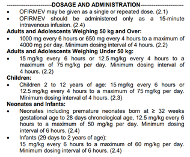
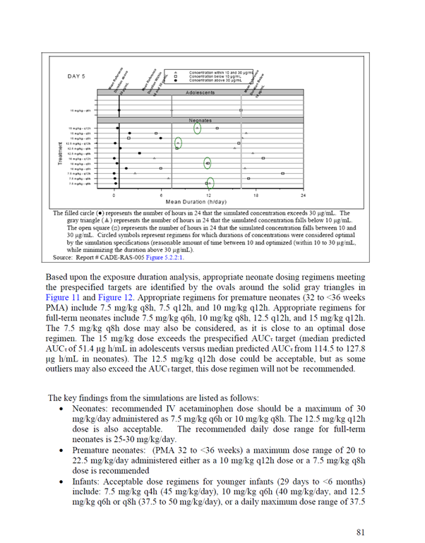
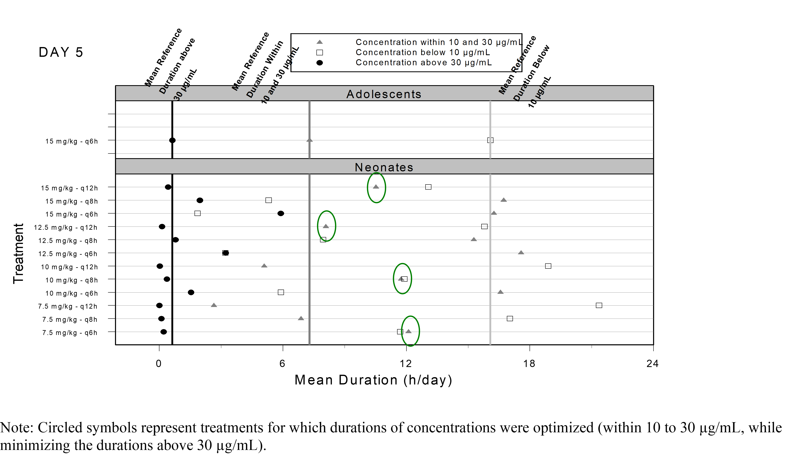

Back in November 2010 the FDA approved Ofirmev (acetaminophen) intravenous injection for use in ages 2 to 16 years for the management of mild to moderate pain and reduction of fever. For more details refer to the [Clinical Pharmacology Biopharmaceutics Reviews](https://www.accessdata.fda.gov/drugsatfda_docs/nda/2010/022450Orig1s000ClinPharmR.pdf "Ofirmev (acetaminophen) Injection FDA Drug Approval Package") and to the [approval letter](https://www.accessdata.fda.gov/drugsatfda_docs/nda/2010/022450Orig1s000Approv.pdf). We subsequently published part of the modeling and simulation work in this paper entitled [Safety and population pharmacokinetic analysis of intravenous acetaminophen in neonates, infants, children, and adolescents with pain or Fever](https://pubmed.ncbi.nlm.nih.gov/22768009/). In this post, I will cover part of the modeling and simulation analyses and key graphical outputs that were used in the published manuscript and/or ended in the FDA publicly available review.

The FDA drug label clearly mentioned that the approved dosage was based on modeling and simulation: "The pharmacokinetic exposure of OFIRMEV observed in children and adolescents is similar to adults, but higher in neonates and infants. **Dosing simulations from pharmacokinetic data** in infants and neonates suggest that dose reductions of 33% in infants 1 month to \< 2 years of age, and 50% in neonates up to 28 days, with a minimum dosing interval of 6 hours, will produce a pharmacokinetic exposure similar to that observed in children age 2 years and older." The currently approved dosage is shown below:



One of the key exposure metrics that we needed to understand and balance were the mean durations of how long the PK concentrations would stay below 10 μg/mL, between 10-30 μg/mL and above 30 μg/mL in a 24 hours period:



As seen in the snapshot we simulated 7.5 mg/kg to 15 mg/kg with 2.5 mg/kg increments and varied the dosing intervals from q6h to q12h with 2h increments.

The population PK model for intravenous acetaminophen was a two compartment model with allometric scaling on clearances and volumes and a maturation function on clearance below I reproduce the maturation of clearance versus age manuscript figure 3:

```{r,dev='ragg_png'}
#| message: false
#| warning: false
#| paged-print: true
#| fig-height: 5
#| fig-width: 9

library(tidyr)
library(dplyr)
require(ggplot2 )
library(patchwork)
library(ggquickeda)
library(ggh4x)
library(ggrepel)


Figure1 <- read.csv("Figure1.csv")

ggplot(Figure1,aes(PNA,CLpopnowt))+
  geom_vline(xintercept = c(29/4.14,26,52,
                            2*52,12*52 ),
             linetype="dashed",
             color="grey50")+
  geom_line(col="red")+
  geom_point(aes(y=CLi_noWT))+
  annotate("text",x =29/4.14+0.8, y = 2,label="29 Days",color="grey50")+
  annotate("text",x =26, y = 28,label="6 Months",color="grey50")+
  annotate("text",x =52, y = 32,label="12 Months",color="grey50")+
  annotate("text",x =2*52+17, y = 2,label="2 Years",color="grey50")+
  annotate("text",x =12*52, y = 2,label="12 Years",color="grey50")+
  scale_x_log10(breaks =c(0.1,1,10,100,1000),
                labels = c(0.1,1,10,100,1000),
                expand = c(0, 0, 0, 0)
                )+
  scale_y_continuous(
    breaks=c(0,10,20,30,40),
    expand = c(0, 0, 0.1, 0),
    sec.axis = sec_axis(~ . /18.40,
                        name ="Ratio",
                        breaks =c(0,0.25,0.5,0.75,1,1.25,1.5,1.75,2),
                        labels =c("× 0","× 0.25","× 0.5",
                                  "× 0.75","× 1","× 1.25",
                                  "× 1.5","× 1.75","× 2")))+
  theme_bw()+
  theme(panel.grid.minor = element_blank())+
  annotation_logticks(sides = "bt",outside = FALSE,
                      short = unit(.5,"mm"),
                      mid = unit(1,"mm"),
                      long = unit(2,"mm"))+
  coord_cartesian(ylim=c(0,40),xlim = c(0.1,1000),
                  clip = "off")+
  labs(x="Post Natal Age (Weeks)",
       y="Clearance (L/h/70kg)")

```

Below I code the population PK model, simulate and plot PK profiles at Day 5 after and intravenous 15 min of 15 mg/kg q6h and 12.5 mg/kg q4h:

```{r,dev='ragg_png'}
#| message: false
#| warning: false
#| paged-print: true
#| fig-height: 5
#| fig-width: 8

library(mrgsolve)
library(data.table)
pkmodel2cmt <- '
$PARAM @annotated
CL    : 18.4    : Clearance CL (L/h)
V     : 16      : Central volume Vc (L)
Vp    : 59.5    : Peripheral volume Vp (L)
Qp    : 97.8    : Intercompartmental clearance Q (L/h)
SLPCL : -0.678  : Slope of the maturation function
TCL   : 41      : Half-life of the maturation function (weeks)
ETAVratio  : 2.03      : shared eta ratio

$PARAM @annotated // reference values for covariate
WT    : 75    : Weight (kg)
PNA   : 936   : Age  (weeks)

$PKMODEL cmt="CENT PER", trans=11
$MAIN
double CLi = CL * (1+ SLPCL*exp(-PNA*0.69315/TCL))*
    pow((WT/75.0), 0.75)*exp(nCL); 
double V1i = V *
    pow((WT/75.0), 1)*exp(nVC);  
double V2i = Vp *pow((WT/75.0),    1)*exp(nQ);
double Qi  = Qp *pow((WT/75.0), 0.75)*exp(ETAVratio*nQ);

$OMEGA @annotated @block
nCL : 0.14        : ETA on CL
nVC : 0.126 0.38  : ETA on Vc

$OMEGA @annotated @block
nQ : 0.0383       : ETA on Q

$TABLE
double CP   = CENT/V2i;

$CAPTURE CP CLi V1i V2i Qi WT PNA
'
modcovsim <- mcode("pkmodel2cmt", pkmodel2cmt)

partab <- setDT(modcovsim@annot$data)[block=="PARAM", .(name, descr, unit)]
partab <- merge(partab, melt(setDT(modcovsim@param@data), meas=patterns("*"), var="name"))
#knitr::kable(partab)

idata <- data.table(id=1:2, WT=c(70.0,70.0), PNA = c(936,936))
ev1 <- ev(id=1:2,time = 0,
          amt = c(15*70.0,12.5*70.0),
          cmt = 1, rate =c(15*70.0/0.25,12.5*70.0/0.25),
          addl = c(5*4,5*6), ii=c(6,4))

data.dose <- ev(ev1)
data.dose <- setDT(as.data.frame(data.dose))
data.all <- data.table(idata, data.dose)
data.all$ID<- data.all$id

outputsim <- modcovsim %>%
  data_set(data.all) %>%
  zero_re() %>%
  mrgsim(end = 5*24, delta = 0.1) %>%
  as.data.frame %>%
  as.data.table

outputsim <- outputsim %>%
  filter(time>=4*24 &time <=5*24) %>%
  mutate(time=time-4*24)%>%
  filter(time<=12)%>%
  select(ID,time,CP)%>%
  mutate(interval= ifelse(ID==1,"q6h","q4h"))

ggplot(outputsim,aes(time,CP))+
  geom_hline(yintercept = c(5,10,30))+
  geom_vline(xintercept = c(0,0+12))+
  geom_line(alpha = 0.2, size = 1,aes(group=ID,color=interval)) +
  scale_y_log10()+
  labs(y = "Plasma Concentrations (mg/L)", x = "Time (h)")+
  coord_cartesian(xlim=c(0,0+12))+
  theme_bw()


```

Next we compute the durations of the PK profiles above thresholds of interest using 5 as an example:

```{r,dev='ragg_png'}
#| message: false
#| warning: false
#| paged-print: true
#| fig-height: 5
#| fig-width: 8


outputsimsum <- outputsim %>%
  group_by(ID,interval)  %>%
  summarize(observations_above_5 = sum(CP >= 5, na.rm = TRUE)*0.1,
            observations_below_5 = sum(CP < 5, na.rm = TRUE)*0.1,
            AUC = sum(diff(time) * (CP[-1] + CP[-n()])) / 2            
  ) 
outputsimsum

```
The plot I wanted to reproduce was this one:


At the time, many of today's tool that we take for granted did not exist, S-plus was still around and the simulation were done in one of my prefered modeling and simulation software of all time: Pharsight's Trial Simulator. It allowed the simulation of many scenarios on the fly with nice interface and interactive fast simulations. For this post, I digitized the data from the FDA review and reproduced it using today's tools: `ggplot2` and `ggforce`

```{r,dev='ragg_png'}
#| message: false
#| warning: false
#| paged-print: true
#| fig-height: 5
#| fig-width: 8

library(ggforce)

 durationdata <- read.csv("durationdata.csv")
  durationdata$freq <- factor(durationdata$freq)
  durationdata$freq <- factor(durationdata$freq,
                              levels=c("q6h","q8h","q12h"))
  
  durationdata$dose <- factor(durationdata$dose)
  durationdata$dose <- factor(durationdata$dose,
                              levels=rev(c("7.5 mg/kg","10 mg/kg",
                                       "12.5 mg/kg","15 mg/kg")))
  
  
  durationdata$type <- factor(durationdata$type)
  durationdata$type <- factor(durationdata$type,
                              levels=c("below 10","within 10 and 30","above 30"),
                              labels =c("≤10 μg/mL",
                                        "<10 — ≤30 μg/mL",
                                        ">30 μg/mL"))
  
  
  
 ggplot(durationdata %>%
         filter(agegroup=="Neonates"),aes(time,freq))+
  geom_point(aes(shape=type,color=type))+
  geom_mark_circle(data=durationdata %>%
                     filter(agegroup== "Neonates",
                            dose== "12.5 mg/kg",
                            freq== "q6h",
                            time<6),
                   aes(label="Approved"),
                   color = "darkgreen",
                   con.colour = "darkgreen" )+

  geom_vline(data=durationdata %>%
               filter(agegroup!="Neonates")%>%
               mutate(agegroup=NULL,dose=NULL),
             aes(xintercept = time,
                 linetype=type
                 
             ),show.legend = FALSE)+
  
  geom_text(data=data.frame(
    x =  durationdata %>%
      filter(agegroup!="Neonates")%>%
      pull(time),
    y=-Inf,
    label = round(durationdata %>%
                    filter(agegroup!="Neonates")%>%
                    pull(time),1),
    dose =factor("7.5 mg/kg",
                 levels=c("15 mg/kg","12.5 mg/kg",
                          "10 mg/kg","7.5 mg/kg"))),
    aes(x=x,label=label,y=y),
    color="darkgray",vjust=0)+
  
  geom_text(data=data.frame(
    x =  durationdata %>%
      filter(agegroup!="Neonates")%>%
      pull(time),
    y=Inf,
    label = c("Adolescents reference values:\n>30 μg/mL","<10 — ≤30 μg/mL","≤10 μg/mL"),
    dose =factor("15 mg/kg",
                 levels=c("15 mg/kg","12.5 mg/kg",
                          "10 mg/kg","7.5 mg/kg"))),
    aes(x=x,label=label,y=y),
    color="darkgray",vjust=0,hjust=0,angle=0)+
  
  
  facet_grid(dose~.,scales="free_y",switch = "y")+
  theme_bw()+
  theme(strip.placement = "outside",
        strip.text.y.left = element_text(angle=0),
        axis.title.y.left = element_blank(),
        legend.position = "bottom",
        plot.title.position = "plot")+
  scale_x_continuous(breaks=c(0,6,12,18,24))+
  coord_cartesian(xlim=c(0,24),clip = "off")+
  scale_shape_manual(values=c("square open","triangle","circle"))+
  scale_color_manual(values=c("black","gray","black"))+
  labs(shape="PK concentrations",color="PK concentrations",
       title = "Neonates",
       subtitle = "Day 5",
       x="Mean Duration (h/day)")+
  guides(color= guide_legend(reverse=TRUE),
         shape = guide_legend(reverse = TRUE))
```

I opted for different decisions on some of the visual aspects e.g. I removed the separate facet for the reference Adolescents as kept the data as reference vertical lines with labels showing their values. I labeled the reference lines without an angle and since we now know what the FDA ended up approving I am encircled it using `ggforce::geom_mark_circle`.

What would be your take to illustrate duration of time above thresholds to compare dosing regimens? As always, reach out at the [LinkedIn Post](https://www.linkedin.com/in/samer-mouksassi-pharm-d-phd-fcp-571555b/) or github to propose your ideas and to continue the discussion !
