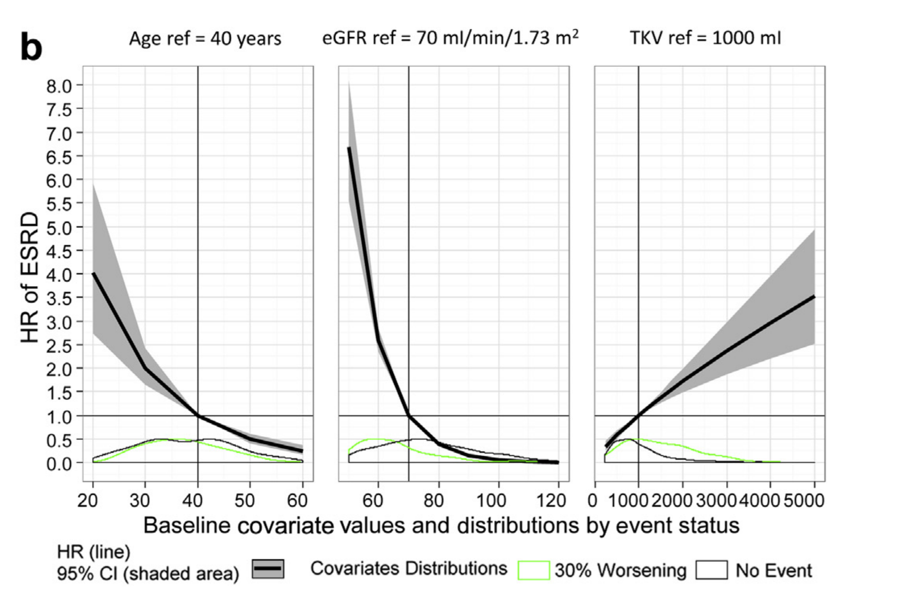

This blog post is the first covering the Qualification of Total Kidney Volume as a [Drug development tool](https://www.fda.gov/drugs/development-approval-process-drugs/drug-development-tool-ddt-qualification-programs) which was detailed in these publications [Total Kidney Volume Is a Prognostic Biomarker of Renal Function Decline and Progression to End-Stage Renal Disease in Patients With Autosomal Dominant Polycystic Kidney Disease](https://pubmed.ncbi.nlm.nih.gov/29142971/) and [Drug Development Tool for Trial Enrichment in Patients With Autosomal Dominant Polycystic Kidney Disease](https://pmc.ncbi.nlm.nih.gov/articles/PMC5678607/). The full FDA review can be found [here](https://www.fda.gov/drugs/drug-development-tool-ddt-qualification-programs/reviews-qualification-biomarker-total-kidney-volume-studies-treatment-autosomal-dominant-polycystic)

I will be using simulated data that mimic the original which will allow me to illustrate the modeling and visualization techniques used for this analysis.

Autosomal dominant polycystic kidney disease is the most common hereditary kidney disease. A promising imaging biomarker measuring the kidney volume was being evaluated for tracking and predicting the natural history of the disease. While the original data had many clinical covariates I will be only using the ones that were found to be important which were the baseline total kidney volume (tkv_bsl), the age (age_bsl) and the glomerular filtration rate (egfr_bsl). As usual we want to look at the data first!

```{r,dev='ragg_png'}
#| message: false
#| warning: false
#| paged-print: true
#| fig-height: 5
#| fig-width: 9

library(ggplot2)
library(patchwork)
library(dplyr)
library(tidyr)
require(ggrepel)
library(table1)
library(tidyvpc)
library(ggquickeda)
library(ggh4x)
library(lattice)
source("ggkmrisktable.r")
source("compute_HR_deltamethod.r")

tableau10 <- c("#1F77B4","#FF7F0E","#2CA02C","#D62728","#9467BD",
               "#8C564B","#E377C2","#7F7F7F","#BCBD22","#17BECF")

esrd <- read.csv("esrdendpoint.csv")
esrd$Endpoint <- "esrd"

esrd  <- esrd %>% 
  mutate(tkv_bsl_log  = log(tkv_bsl))%>% 
   mutate(tkv_bsl_ht  = tkv_bsl/ht_bsl)%>% 
  mutate(tkv_bsl_ht_log  = log(tkv_bsl_ht))

```

##### Kaplan-Meier plot of key covariate split by Median: M1 (Below Median) M2 (Above Median)

```{r,dev='ragg_png'}
#| message: false
#| warning: false
#| paged-print: true
#| fig-height: 5
#| fig-width: 9

esrdplot  <- esrd 

ggkmrisktable(data = esrdplot, time= "time", status ="status",
              exposure_metrics =c("tkv_bsl_ht","age_bsl","egfr_bsl"),
              exposure_metric_split = "median",
              xlab = "Time of follow_up (years)",
              ylab ="Overall not having esrd probability",
              exposure_metric_soc_value = -9999,
              exposure_metric_plac_value = -99,
              nrisk_table_textsize = 3,
              km_median = "medianci",
              km_ticks = FALSE,
              show_exptile_values = TRUE,
              show_exptile_values_pos = "left",
              show_exptile_values_textsize = 3,
              nrisk_table_breaktimeby = 5,
              return_list = FALSE
              )+
  facet_wrap2(~expname,ncol = 3,
                     strip = strip_nested())+
  scale_x_continuous(expand = expansion(mult=c(0,0),add=c(2,0)),)

```

The plot clearly shows that all these covariates are important and when splitting by median we see a clear separation between the curves. These variables are not independent and to assess whether the effects of tkv_bsl and age_bsl depend on egfr_bsl, I first split the egfr_bsl into egfr_bsl_cat: below/above median categories and redo the plot coloring by egfr category.

```{r,dev='ragg_png'}
#| message: false
#| warning: false
#| paged-print: true
#| fig-height: 5
#| fig-width: 9

esrdplot <- esrdplot %>% 
  mutate(egfr_bsl_med = quantile(egfr_bsl, 0.5, na.rm = TRUE)) %>% 
  mutate(egfr_bsl_cat = case_when(egfr_bsl <= egfr_bsl_med ~ "egfr_bsl ≤ 68",
                                  egfr_bsl  > egfr_bsl_med ~ "egfr_bsl > 68"))

ggkmrisktable(data = esrdplot, time= "time", status ="status",
              exposure_metrics =c("tkv_bsl","age_bsl"),
              exposure_metric_split = "median",
              xlab = "Time of follow_up (years)",
              ylab ="Overall event probability",
              exposure_metric_soc_value = -9999,
              exposure_metric_plac_value = -99,
              groupvar1 = "expname",
              groupvar2 = "exptile",
              color_fill = "egfr_bsl_cat",
              linetype = "exptile",
              nrisk_table_textsize = 3,
              nrisk_table_variables = c("cum.n.event"),
              km_median = "medianci",
              km_ticks = FALSE,
              show_exptile_values = TRUE,
              show_exptile_values_pos = "left",
              show_exptile_values_textsize = 3,
              nrisk_table_breaktimeby = 5)+
  facet_wrap2(~expname,ncol = 4,strip = strip_nested())+
  scale_x_continuous(expand = expansion(mult=c(0,0),add=c(2,0)))+
 theme_bw(base_size = 14)+
  theme( strip.background = element_rect(fill="#475c6b"),
         strip.text =       element_text(face = "bold",color = "white"),
         strip.text.x = element_text(size = 14))


```

This shows that the curves criss-cross depending on which combination of values we have and in statistical terms this illustrate "interactions" between the various covariates. This was formally tested during modeling using likelihood ratio tests for the main and interaction terms the selected model included two-way interactions between baseline egfr and age and between baseline log of total kidney volume and age:

```{r,dev='ragg_png'}
#| message: false
#| warning: false
#| paged-print: true
#| fig-height: 5
#| fig-width: 9

library(rms)
library(risksetROC)

dd <- datadist(esrd)
options(datadist='dd')

#pick reference values that we want
dd$limits$age_bsl[2] <- 40    
dd$limits$tkv_bsl_log[2] <- log(1000)   
dd$limits$egfr_bsl[2] <- 70 


summaryextracoxfit <- function(coxfit, predictors="test", data=x){
  cs   <-  coxfit
  ROC1 <-      risksetROC(Stime=data$time, status=data$status,
                          marker=cs$linear.predictor,
                          predict.time=1, method="Cox",plot=F)$AUC
  ROC5 <-      risksetROC(Stime=data$time, status=data$status,
                          marker=cs$linear.predictor,
                          predict.time=5, method="Cox",plot=F)$AUC
  LR <- cs$stats["Model L.R."]
  tab = cbind(LR=LR,ROC1=ROC1,ROC5=ROC5)
  rownames(tab) <- predictors
  return(tab)
}

fitSURVfinal <- cph(Surv(time, status) ~ 1 +  egfr_bsl+tkv_bsl_log+ age_bsl+ egfr_bsl:age_bsl + tkv_bsl_log:age_bsl,data=esrd, x = TRUE, y=TRUE)
fitSURV1 <- cph(Surv(time, status) ~ 1 +  age_bsl,data=esrd, x = TRUE, y=TRUE)
fitSURV2 <- cph(Surv(time, status) ~ 1 +  tkv_bsl_log,data=esrd, x = TRUE, y=TRUE)
fitSURV3 <- cph(Surv(time, status) ~ 1 +  egfr_bsl,data=esrd, x = TRUE, y=TRUE)
fitSURVnointer <- cph(Surv(time, status) ~ 1 +  egfr_bsl+ tkv_bsl_log + age_bsl,data=esrd, x = TRUE, y=TRUE)


modelcomparetable <- rbind(
  summaryextracoxfit(fitSURV1, data=esrd,
                     predictors="+ egfr_bsl "),
  summaryextracoxfit(fitSURV2, data=esrd,
                     predictors="+ tkv_bsl_log "),
  summaryextracoxfit(fitSURV3, data=esrd,
                     predictors="+ age_bsl "),
  summaryextracoxfit(fitSURVnointer, data=esrd,
                     predictors="+ egfr_bsl + tkv_bsl_log + age_bsl "),
  summaryextracoxfit(fitSURVfinal, data=esrd,
                     predictors="+ // + egfr_bsl:age_bsl+ tkv_bsl_log:age_bsl ")
)

modelcomparetable
```

The complete model building steps and evaluation using cross-validation are included in the FDA review and will be skipped here. Now that we have a final model we want to understand the meaning of these interactions and how they interplay to have an effect on the hazard ratios. The `rms` package has nice automated utilities to automatically generate forest plots of hazard ratios the default produce hazard ratios between the 75th to the 25th percentiles keeping the other covariates at the reference value. In the repo I include this file `compute_HR_deltamethod.r` which uses the delta method and allow the user to fully specify the set of covariates between the test and reference and unlike `rms::summary` the user can modify more than one covariate at a time. I first validate that the code reproduces `rms` then I compute the Hazard ratio and associated 95%CI for reference values of egfr = 50 ml/min , total kidney volume of 1 L, age of 40 years to test values of egfr = 45 ml/min , total kidney volume of 1.2 L, age of 42 years:

```{r,dev='ragg_png'}
#| message: false
#| warning: false
#| paged-print: true
#| fig-height: 5
#| fig-width: 9

plot(summary(fitSURVfinal))

plot(summary(fitSURVfinal,egfr_bsl=c(50,50),
                    age_bsl=c(40,40),
                   tkv_bsl_log=c(log(1000),log(1200))))


summary(fitSURVfinal,egfr_bsl=c(50,50),
                    age_bsl=c(40,40),
                   tkv_bsl_log=c(log(1000),log(1200)))[4,c(4,6,7)]

computerelativeHR(egfrr=50,tkvr=1000,ager=40,egfrt=50,tkvt=1200,aget=40, conf.int=0.95)


```

And now I can use `computerelativeHR` to compute the HR for any set of ref to test values and this what powered the paper R Shiny app: [Online Interactive Hazard Ratio Calculator](https://pharmacometrics.shinyapps.io/KIreports/){target="_blank"}

```{r,dev='ragg_png'}
#| message: false
#| warning: false
#| paged-print: true
#| fig-height: 5
#| fig-width: 9

computerelativeHR(egfrr=50,tkvr=1000,ager=40,egfrt=45,tkvt=1200,aget=42, conf.int=0.95)

```

Another nice `rms` feature is automated `Predict` that can plot the log relative hazard ratio versus each predictor keeping the others at reference values:

```{r,dev='ragg_png'}
#| message: false
#| warning: false
#| paged-print: true
#| fig-height: 5
#| fig-width: 9

plot(Predict(fitSURVfinal))
```

Alternatively the user can specify a "grid" of values and produce a customized plot using `lattice` or `ggplot2`:

```{r,dev='ragg_png'}
#| message: false
#| warning: false
#| paged-print: true
#| fig-height: 5
#| fig-width: 9

finalmodelpredictions <-  Predict(fitSURVfinal,
                                  tkv_bsl_log=log(c(500,1000,1500)),
                                  age_bsl    =c(20,40,60),
                                  egfr_bsl   =c(40,50,60)
)

ap <- function(...) panel.abline(h=1,lty=3,col="red") 
plot(finalmodelpredictions, ~ tkv_bsl_log | egfr_bsl,
     groups="age_bsl",layout=c(3,1),
     ylab="Log Relative Hazard Ratio",
             col="black", addpanel=ap,alpha=0.5,
             col.fill=gray(seq(.8, .75, length=5)))


finalmodelpredictionsdf <- as.data.frame(finalmodelpredictions)

finalmodelpredictionsdf$egfr_bsl_2 <- paste("eGFR:",finalmodelpredictionsdf$egfr_bsl,"mL/min")
finalmodelpredictionsdf$age_bsl_2 <- paste(finalmodelpredictionsdf$age_bsl,"years")

ggplot(finalmodelpredictionsdf,aes(x=exp(tkv_bsl_log),y=yhat,
                                   color= as.factor(age_bsl_2),
                                   fill = as.factor(age_bsl_2)))+
  geom_ribbon(aes(ymin=lower,ymax=upper,group=interaction(age_bsl)),alpha=0.2,
              color=NA)+
  geom_line()+
  facet_grid(~egfr_bsl_2)+
    labs(y="Log Relative Hazard Ratio",
         x="Baseline Kidney Volume (mL) - Log10 Scale",
         fill="Baseline Age",color="Baseline Age")+
   theme_bw(base_size = 14)+
   theme(legend.position="top",
         strip.background = element_rect(fill="#475c6b"),
         strip.text =       element_text(face = "bold",color = "white"),
       strip.text.x = element_text(size = 14))+
  scale_x_log10(breaks=c(500,700,1000,1500))+
  scale_color_manual(values=tableau10)+
  scale_fill_manual(values=tableau10)

```

My goal here is try to reproduce figure 4b from [Total Kidney Volume Is a Prognostic Biomarker of Renal Function Decline and Progression to End-Stage Renal Disease in Patients With Autosomal Dominant Polycystic Kidney Disease](https://pubmed.ncbi.nlm.nih.gov/29142971/) The code below constructs a grid of values, predict the Hazard Ratios taking into account interactions and use the `deltamethod` to compute the associated 95% CI:

```{r,dev='ragg_png'}
#| message: false
#| warning: false
#| paged-print: true
#| fig-height: 5
#| fig-width: 9

tkvt  <- 1000* c(0.25,0.50, 0.75, 1.00, 1.25, 1.50, 1.75 ,2.00,3,4,5)
egfrt <- seq(50,  100,10)
aget  <- 40* c(0.50, 0.75, 1.00, 1.25, 1.50)
matrixhr<- data.frame(
  matrix(rep(NA,length(tkvt)+length(egfrt)+length(aget))*5,ncol=5,
         nrow=length(tkvt)+length(egfrt)+length(aget)))
for (i in 1:length(egfrt) ){
  matrixhr[i,1] <- "egft"
    matrixhr[i,2] <- egfrt[i]
    matrixhr[i,3:5] <- computerelativeHR(egfrt=egfrt[i],tkvt=1000,aget=40)
  }
for (i in 1:length(tkvt) ){
  matrixhr[i+length(egfrt),1] <- "tkvt"
  matrixhr[i+length(egfrt),2] <- tkvt[i]
  matrixhr[i+length(egfrt),3:5] <- computerelativeHR(egfrt=70,tkvt=tkvt[i],aget=40)
     }
for (i in 1:length(aget) ){
  matrixhr[i+length(egfrt)+length(tkvt),1] <- "aget"
    matrixhr[i+length(egfrt)+length(tkvt),2] <- aget[i]
    matrixhr[i+length(egfrt)+length(tkvt),3:5] <-  computerelativeHR(egfrt=70,tkvt=1000,aget=aget[i])

}

names(matrixhr) <- c("cov","value","HR","LOW","HIGH")

refvalues <- data.frame(cov=c("egft","tkvt","aget"),ref=c(70,1000,40))

matrixhr<- left_join( matrixhr ,refvalues)

matrixhr<- matrixhr%>%
group_by(cov)%>%
mutate(valuecov= value/ref)
  
matrixhr$cov <- factor(matrixhr$cov)
levels(  matrixhr$cov )  <-   c("Age, ref=40 years",
                                "eGFR ref=70 mL/min/1.73m2",
                                "TKV ref=1000 mL")

covdistribution <- esrd[esrd$tkv_bsl<5100,c("tkv_bsl","age_bsl","egfr_bsl","status")]
covdistribution <- covdistribution[covdistribution$age_bsl>=20,c("tkv_bsl","age_bsl","egfr_bsl","status")]
covdistribution <- covdistribution[covdistribution$age_bsl<=60,c("tkv_bsl","age_bsl","egfr_bsl","status")]
covdistribution <- covdistribution[covdistribution$egfr_bsl>=50,c("tkv_bsl","age_bsl","egfr_bsl","status")]
covdistribution <- covdistribution[covdistribution$egfr_bsl<=101,c("tkv_bsl","age_bsl","egfr_bsl","status")]
covdistribution<- gather(covdistribution,variable,value,-status,factor_key = TRUE)
levels(  covdistribution$variable ) <- c("TKV ref=1000 mL","Age, ref=40 years","eGFR ref=70 mL/min/1.73m2")
covdistribution$cov <- covdistribution$variable
covdistribution$status <-   factor(covdistribution$status)
covdistribution$cov <- as.factor(covdistribution$cov)
covdistribution$cov <- factor(covdistribution$cov,
                              levels =   c("Age, ref=40 years",
                                           "eGFR ref=70 mL/min/1.73m2",
                                           "TKV ref=1000 mL"))


ggplot(matrixhr,aes(x=value,y=HR,ymin=LOW,ymax=HIGH,group=cov) )+
    geom_ribbon(aes(fill="95%CI (shaded area)"),alpha=0.8,
                color="transparent",
                 show.legend = c(fill = TRUE, linetype = FALSE))+
    geom_vline(aes(xintercept=ref) )+
    geom_line(aes(linetype="HR (line)"))+
    geom_hline(yintercept = 1 ) +
    geom_density(data=covdistribution[covdistribution$status=="1",] ,
             aes(y = 0.9*(..scaled..), color="ESRD",
     x=value) ,alpha=0.2,inherit.aes = FALSE,linetype="dashed") +
    geom_density(data=covdistribution[covdistribution$status=="0",] ,
              aes(y = 0.9*(..scaled..),color="No Event",
     x=value) ,alpha=0.2,inherit.aes = FALSE,linetype="dashed")+
    facet_grid(~cov,scales="free_x") +
  scale_y_continuous(breaks=seq(0,8,0.5))+
    theme_bw(base_size = 14)+
    theme(legend.position="bottom",
          strip.background = element_rect(fill = 'white', colour = 'black'),
       strip.text.x = element_text(size = 14)) +
  xlab("Baseline Covariate Values and Distributions by Event Status")+
  ylab("Hazard Ratio (HR) of ESRD")+
  labs(colour="Covariate Distributions",
       linetype="",fill="")+
  scale_fill_manual(values = c("gray"))+
  scale_color_manual(values = c("ESRD" = "green","No Event" = "black"))+
  guides(linetype = guide_legend(order=1),
         fill = guide_legend(order=2,override.aes = list(linetype=NA)),
         color = guide_legend(order=3)
         )

```

These plots are close enough, I modified the range of covariate predictions to keep it within most common values. I also provide a new plot showing hazard ratios (log scale) versus covariate and since log of total kidney volume was used as a covariate plotting against total kidney volume show an exponential saturating shape. Instead of densities I use boxplots which one do you prefer?

```{r,dev='ragg_png'}
#| message: false
#| warning: false
#| paged-print: true
#| fig-height: 5
#| fig-width: 9

covdistribution$status_fct <- ifelse(covdistribution$status==1,"ESRD","no event")
covdistribution$status_fct <- factor(covdistribution$status_fct,levels=c("no event","ESRD"))

   ggplot(matrixhr %>% 
            filter(value<3500),aes(x=value,y=HR,ymin=LOW,ymax=HIGH,group=cov) )+
    geom_ribbon(aes(fill="95%CI (shaded area)"),
                alpha=0.3,color="transparent",
                 show.legend = c(fill = TRUE, linetype = FALSE))+
    geom_vline(aes(xintercept=ref) )+
    geom_line(aes(linetype="HR (line)"))+
    geom_hline(yintercept = 1 )+
    geom_boxplot(data=covdistribution%>% 
            filter(value<3500),
             aes(x=value,y= 0.1,color=status_fct),
             alpha=0.4,inherit.aes = FALSE, width = 0.3,
              show.legend = c(fill = FALSE, color = TRUE),
             outliers = FALSE)+
    facet_grid(~cov,scales="free_x") +
    scale_y_log10()+
    labs(x="Baseline Covariate Values",
       y="Hazard Ratio (HR) of ESRD - log Scale",
       linetype="",color="Covariate Distributions",
       fill="")+
 theme_bw(base_size = 14)+
  theme(legend.position="bottom",
         strip.background = element_rect(fill="#475c6b"),
         strip.text =       element_text(face = "bold",color = "white"),
       strip.text.x = element_text(size = 14))+
  guides(linetype = guide_legend(order=1),
         fill = guide_legend(order=2,override.aes = list(linetype=NA))
         )+
     scale_fill_manual(values="black")+
     scale_color_manual(values = tableau10)
   
    
```

At the end I wanted to try another modeling strategy from the `partykit` package:

-   Conditional Inference Trees: `ctree`

-   Conditional Random Forests: `cforest`

These methods automatically detect interactions and splits and it is pretty interesting !

```{r,dev='ragg_png'}
#| message: false
#| warning: false
#| paged-print: true
#| fig-height: 5
#| fig-width: 9
library(survival)
library(partykit)
set.seed(165461)
simple_tree <- ctree(Surv(time, status) ~ egfr_bsl+tkv_bsl+ age_bsl, 
                     data = esrd,
                     control = ctree_control(
                       alpha = 0.01,      # Stricter significance (default 0.05)
                       maxdepth = 3,      # Limits the tree to 3 levels deep
                       minsplit = 50,     # Must have 50 obs to try a split
                       minbucket = 20     # Each leaf must have at least 20 obs
                     ))
plot(simple_tree)


surv_forest <- cforest(Surv(time, status) ~ egfr_bsl+tkv_bsl+ age_bsl, 
                       data = esrd,
                       ntree = 500,
                       control = ctree_control(
                         teststat = "quad",
                         testtype = "Univ",
                         alpha = 0.01,      # Stricter significance (default 0.05)
                       maxdepth = 3,      # Limits the tree to 3 levels deep
                       minsplit = 50,     # Must have 50 obs to try a split
                       minbucket = 20     # Each leaf must have at least 20 obs
                       ))
 plot(gettree(surv_forest))

```

Until next time, keep modeling my friends !
