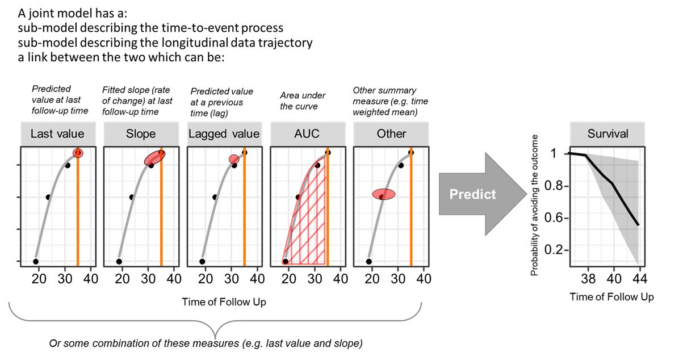
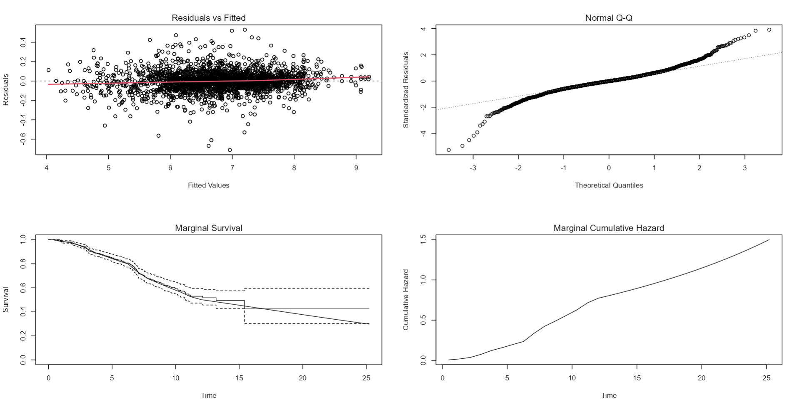
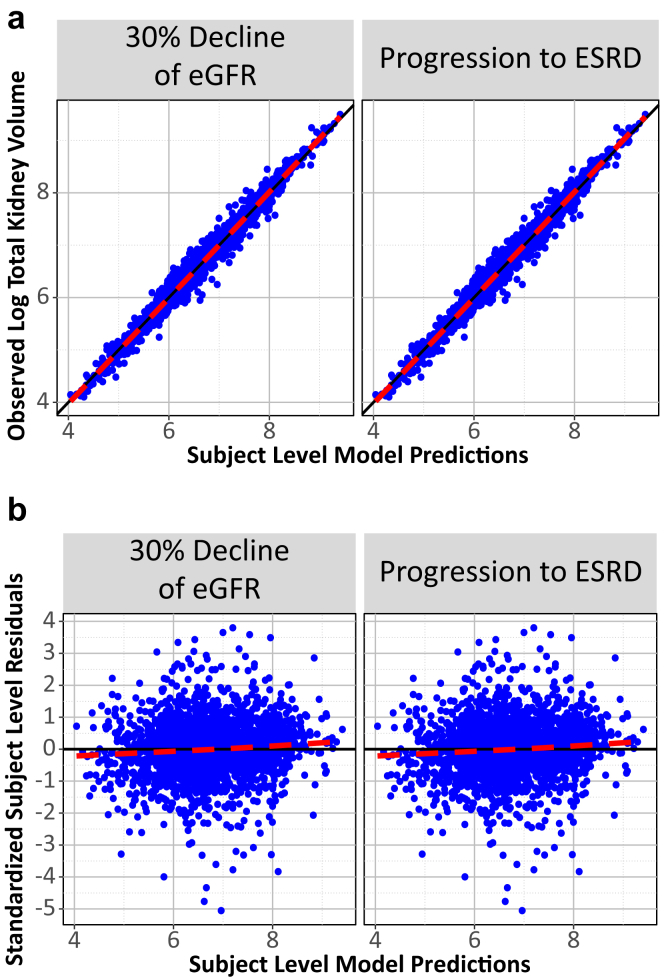
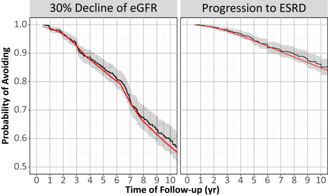
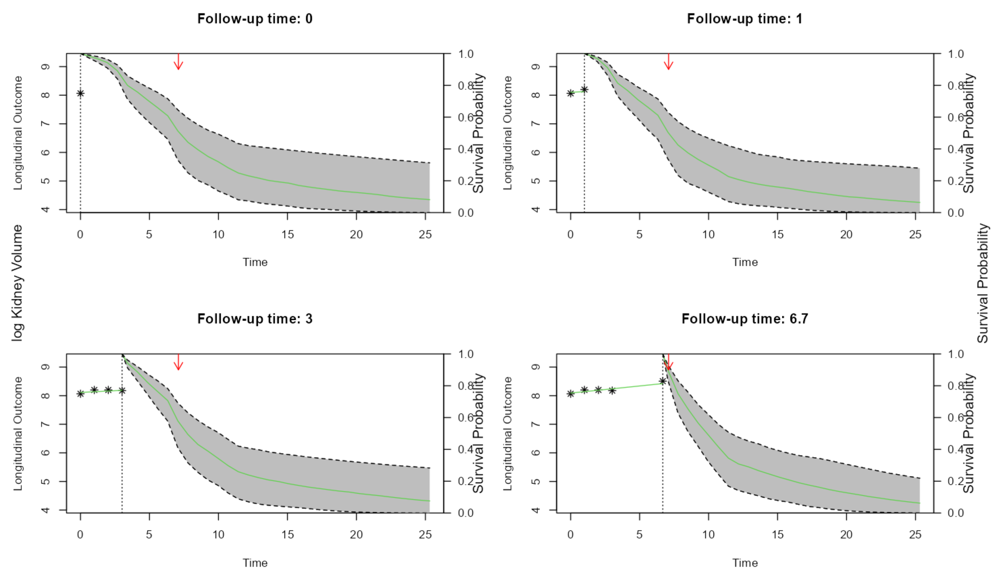
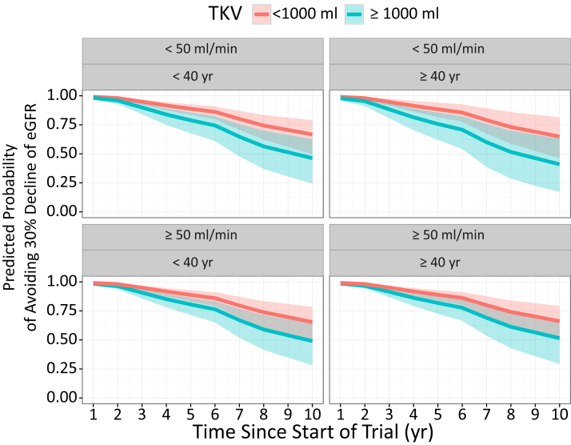
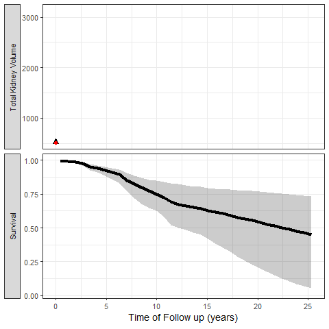

This is the second part of [Qualification of Kidney Volume as a Drug Development Tool: Part 1](https://smouksassi.github.io/posts/ddtoolpart1/){target="_blank"}. Here, I will continue covering the analysis framework and more specifically the joint modeling of longitudinal total kidney volume (TKV) and the outcomes of interest which were 30% decline of glomerular filtration rate (eGFR) or end-stage renal disease (ESRD) to ultimately qualify the model simulations as a drug development tool (DDT) for trial enrichment in patients with autosomal dominant polycystic kidney disease (ADPKD). Since the data is not public I will be using published outputs and share relevant code that can be applied in real-life analysis. For the record, here is a quote from the FDA [Biomarker Qualification Review for Total Kidney Volume](https://www.fda.gov/media/93143/download){target="_blank"}: "Based upon consideration of the strengths and limitations of the data, the Biomarker Qualification Review Team (BQRT) recommends that Total Kidney Volume (TKV) determined at baseline, in combination with patient age and baseline eGFR, can be qualified as a prognostic enrichment biomarker for autosomal dominant polycystic kidney disease (ADPKD) subjects at high risk for a progressive decline in renal function, defined as a confirmed 30% decline in eGFR."

Of note that the FDA not only replicated the findings on the submitted registry data and the data generated via cross validation, but also using clinical trial data that were only available internally to the FDA.

In a first step, linear mixed-effect models with a random intercept were used to fit ln-transformed TKV values, keeping only patients with at least 2 TKV measurements separated by at least 6 months apart. Baseline TKV was defined as the first TKV measurement for a subject, whereas baseline age was the age associated with the first TKV measurement. Correlated random effects on slope and intercept was used

```{r,dev='ragg_png'}
#| message: false
#| warning: false
#| paged-print: true
#| fig-height: 5
#| fig-width: 9
#| eval: false
#| code-fold: false
require(nlme)

fitLME <- lme(logtkv ~ MPYRS,  random= ~ MPYRS | UDERID, data = alltkvdata,
  control = list(msVerbose = 1, maxIter=100, msMaxIter=1000, niterEM=1000))
summary(fitLME )

####
Linear mixed-effects model fit by REML
  Data: alltkvdatajfitmean 
       AIC      BIC    logLik
  939.2572 974.1581 -463.6286

Random effects:
 Formula: ~MPYRS | UDERID
 Structure: General positive-definite, Log-Cholesky parametrization
            StdDev     Corr  
(Intercept) 0.87413534 (Intr)
MPYRS       0.04581673 -0.478
Residual    0.13535305       

Fixed effects:  logtkv ~ MPYRS 
               Value  Std.Error   DF   t-value p-value
(Intercept) 6.669682 0.03478784 1842 191.72454       0
MPYRS       0.051151 0.00234949 1842  21.77093       0
 Correlation: 
      (Intr)
MPYRS -0.413

Standardized Within-Group Residuals:
         Min           Q1          Med           Q3          Max 
-5.263898609 -0.391074859 -0.006556208  0.378224483  3.912862812 

Number of Observations: 2484
Number of Groups: 641 

```

In a second step, a placeholder time to event model is set with baseline eGFR (EGFRBSL) and Age (AGERFST) which were deemed important in the first part analysis. The log of Total Kidney Volume will enter the model via the joint modeling link. The `JM` package has a function named `jointModel` with default link parameterization = `value`. Other supported possibilities are `slope` or `both`. More advanced options can be built using the `derivForm` argument for example the AUC of log of TKV up to the time of the event.


The baseline risk function was chosen to be piecewise linear with equally-spaced lng.in.kn knots. The number of knots was incrementally increased till the AIC started to rise and or no improvement on the goodness of fit was noticed.

```{r,dev='ragg_png'}
#| message: false
#| warning: false
#| paged-print: true
#| fig-height: 5
#| fig-width: 9
#| eval: false
#| code-fold: false
require(JM)

fitSURV <- coxph(Surv(MPYRS, EVFL) ~ 1 + EGFRBSL + AGERFST 
     ,data=e30strictendpointj, x = TRUE)

fit.tkv_e30strict_allpiecewise5 <- jointModel(fitLME, fitSURV,timeVar="MPYRS",verbose=F,
                                              method ="piecewise-PH-aGH",lng.in.kn=5)
fit.tkv_e30strict_allpiecewise10 <- jointModel(fitLME, fitSURV,timeVar="MPYRS",verbose=F,
                                               method ="piecewise-PH-aGH",lng.in.kn=10)
fit.tkv_e30strict_allpiecewise12 <- jointModel(fitLME, fitSURV,timeVar="MPYRS",verbose=F,
                                               method ="piecewise-PH-aGH",lng.in.kn=12)

anova(fit.tkv_e30strict_allpiecewise10,fit.tkv_e30strict_allpiecewise12,test=F)
anova(fit.tkv_e30strict_allpiecewise12,fit.tkv_e30strict_allpiecewise15,test=F)
###
                                     AIC     BIC  log.Lik df
fit.tkv_e30strict_allpiecewise10 2367.87 2457.13 -1163.93   
fit.tkv_e30strict_allpiecewise12 2358.03 2456.21 -1157.01  2
fit.tkv_e30strict_allpiecewise15 2363.56 2475.13 -1156.78  3

summary(fit.tkv_e30strict_allpiecewise12) 
###
Call:
jointModel(lmeObject = fitLME, survObject = fitSURV, timeVar = "MPYRS", 
    method = "piecewise-PH-aGH", verbose = F, lng.in.kn = 12)

Data Descriptives:
Longitudinal Process		Event Process
Number of Observations: 2484	Number of Events: 192 (30%)
Number of Groups: 641

Joint Model Summary:
Longitudinal Process: Linear mixed-effects model
Event Process: Relative risk model with piecewise-constant
		baseline risk function
Parameterization: Time-dependent 

   log.Lik      AIC      BIC
 -1157.014 2358.028 2456.215

Variance Components:
             StdDev    Corr
(Intercept)  0.8733  (Intr)
MPYRS        0.0457 -0.4736
Residual     0.1353        

Coefficients:
Longitudinal Process
             Value Std.Err  z-value p-value
(Intercept) 6.6684  0.0348 191.8738 <0.0001
MPYRS       0.0516  0.0024  21.7459 <0.0001

Event Process
              Value Std.Err  z-value p-value
EGFRBSL      0.0101  0.0032   3.1880  0.0014
AGERFST      0.0004  0.0077   0.0519  0.9586
Assoct       0.8457  0.1204   7.0233 <0.0001
log(xi.1)  -10.9734  0.9986 -10.9884        
log(xi.2)  -10.0710  0.9932 -10.1405        
log(xi.3)   -8.9790  0.9969  -9.0065        
log(xi.4)  -10.0879  0.9980 -10.1083        
log(xi.5)   -9.8822  0.9998  -9.8845        
log(xi.6)  -10.0449  1.0076  -9.9692        
log(xi.7)   -9.0142  0.9962  -9.0486        
log(xi.8)   -9.2201  0.9981  -9.2377        
log(xi.9)   -9.6585  1.0222  -9.4486        
log(xi.10)  -9.4987  1.0476  -9.0670        
log(xi.11)  -9.6459  1.0720  -8.9978        
log(xi.12)  -9.3686  1.0457  -8.9588        
log(xi.13) -10.4570  1.1220  -9.3198        

Integration:
method: (pseudo) adaptive Gauss-Hermite
quadrature points: 3 

Optimization:
Convergence: 0 
```

Notice how in the output of the summary of the jointmodel the association `Assoct` between the predicted "value" and hazard of the event is highly significant \<0.0001. To get the hazard ratio and its 95% confidence interval we exponentiate the output of `confint`. We can also output automated diagnostics using an automatic `plot` method on JM objects.

```{r,dev='ragg_png'}
#| message: false
#| warning: false
#| paged-print: true
#| fig-height: 5
#| fig-width: 9
#| eval: false
#| code-fold: false

 exp (confint(fit.tkv_e30strict_allpiecewise12 ,parm="Event"))
            2.5 %     est.   97.5 %
EGFRBSL 1.0039020 1.010162 1.016460
AGERFST 0.9855089 1.000397 1.015510

par(mfrow=c(2,2))
plot(fit.tkv_e30strict_allpiecewise12,add.KM=T,ask=F)

```



Next, we want to retest within the joint modeling framework whether interactions between, Age, eGFR and TKV are needed which can be done using the `interFact` argument for example below we are testing the interaction between baseline eGFR and log of TKV value:

```{r,dev='ragg_png'}
#| message: false
#| warning: false
#| paged-print: true
#| fig-height: 5
#| fig-width: 9
#| eval: false
#| code-fold: false

fitSURV <- coxph(Surv(MPYRS, EVFL) ~ 1 + EGFRBSL + AGERFST 
     ,data=e30strictendpointj, x = TRUE)

fit.tkv_e30strict_all_interactiontkvegfr <- update(fit.tkv_e30strict_allpiecewise12, 
                             control=list(optimizer="nlminb"),  verbose=T,
                             interFact =list(value=~EGFRBSL,data=e30strictendpointj)
                                           )
summary(fit.tkv_e30strict_all_interactiontkvegfr) 

```

The final model included interaction in the survival sub model `EGFRBSL:AGERFST`:

```{r,dev='ragg_png'}
#| message: false
#| warning: false
#| paged-print: true
#| fig-height: 5
#| fig-width: 9
#| eval: false
#| code-fold: false

fitLME <- lme(logtkv ~ MPYRS,  random= ~ MPYRS | UDERID, data = alltkvdatajfitmean,
              control = list(msVerbose = 1, maxIter=100, msMaxIter=1000, niterEM=1000))
fitSURV <- coxph(Surv(MPYRS, EVFL) ~ 1 + EGFRBSL + AGERFST + EGFRBSL:AGERFST,
                 data=e30strictendpointj, x = TRUE)
jointfinalmodelval <- jointModel(fitLME, fitSURV,timeVar="MPYRS",verbose=F,
                                 method ="piecewise-PH-aGH",lng.in.kn=12,
                                 control=list(optimizer="nlminb")
                                 )


```

The model was also internally validated using standard 5-fold cross validation and the FDA took the extra step to externally validated against data I have never seen. Below I include the figures that were part of the paper:

 

The most exciting application of Joint Models is the capability to simulate trajectories of time and illustrate its impact on the probability of the event:

```{r,dev='ragg_png'}
#| message: false
#| warning: false
#| paged-print: true
#| fig-height: 5
#| fig-width: 9
#| eval: false
#| code-fold: false

alltkvdatajfitmean[alltkvdatajfitmean $UDERID==2250,]
# conditional survival probabilities for Patient 2250  using Monte Carlo
set.seed(123) # we set the seed for reproducibility
ND <- alltkvdatajfitmean[alltkvdatajfitmean$UDERID == 2250 , ]
survPreds <- vector("list", nrow(ND))
for (i in 1:nrow(ND)) {
    set.seed(123)
    survPreds[[i]] <- survfitJM(jointfinalmodel , newdata = ND[1:i, ],idVar="UDERID")
}
# plot of the dynamic survival probabilities
par(mfrow = c(2, 2), oma = c(0, 2, 0, 2))
for (i in c(1,2,4,5)) {
    plot(survPreds[[i]], estimator = "median", conf.int = TRUE,
        include.y = TRUE,fill.area=T, main = paste("Follow-up time:",
            round(survPreds[[i]]$last.time, 1)))
arrows(ND$LASTTIMESEEN[1], 1, ND$LASTTIMESEEN[1], 0.9, col= "red",length=0.1)
}
mtext("log Kidney Volume", side = 2, line = -1, outer = TRUE)
mtext("Survival Probability", side = 4, line = -1, outer = TRUE)
```



We can also simulate clinical trial inclusion criteria and see how these patients TKV trajectories and probabilities of events can be projected:



To conclude this blog I wanted to redo the dynamic predictions using ggplot2 and gganimate

```{r,dev='ragg_png'}
#| message: false
#| warning: false
#| paged-print: true
#| fig-height: 5
#| fig-width: 9
#| eval: false
#| code-fold: true

library(gganimate)

set.seed(123) # we set the seed for reproducibility
ND <- alltkvdatajfitmean[alltkvdatajfitmean$UDERID == 1557 , ]
e30strictendpointj[e30strictendpointj$UDERID == 1557 , ]
survPreds <- vector("list", nrow(ND))
for (i in 1:nrow(ND)) {
  set.seed(123)
  survPreds[[i]] <- survfitJM(jointfinalmodel , newdata = ND[1:i, ],idVar="UDERID")
}

survPreds1 <- as.data.frame(survfitJM(
  jointfinalmodel ,
  newdata = ND[1:1, ],idVar="UDERID")$summaries)
survPreds2 <- as.data.frame(survfitJM(
  jointfinalmodel ,
  newdata = ND[1:2, ],idVar="UDERID")$summaries)
survPreds3 <- as.data.frame(survfitJM(
  jointfinalmodel ,
  newdata = ND[1:3, ],idVar="UDERID")$summaries)


survPreds1$frame <- 1
survPreds2$frame <- 2
survPreds3$frame <- 3
survPredsall <- rbind(survPreds1,survPreds2,survPreds3)
names(survPredsall)<- c("times","Mean","Median","Lower","Upper","frame")
ggplot(survPredsall,aes(times,Median))+
  geom_line()+
  facet_grid(~frame)

survPredsall$facet <- "Survival"

NDobserved <- rbind(ND[1:1,c("MPYRS","logtkv")],
                    ND[1:2,c("MPYRS","logtkv")],
                    ND[1:3,c("MPYRS","logtkv")])

NDobserved$frame <- c(1,2,2,3,3,3)
NDobserved$facet <- "Total Kidney Volume"

fitteddata1<-  data.frame( 
  times=  as.vector(unlist(survPreds[[1]]$fitted.times))[1],
  fittedy= as.vector(unlist(survPreds[[1]]$fitted.y))[1],
  logtkv= ND[1:1,"logtkv"]
)
fitteddata1$frame<-1

fitteddata2<-  data.frame( 
  times=  as.vector(unlist(survPreds[[2]]$fitted.times))[1:2],
  fittedy= as.vector(unlist(survPreds[[2]]$fitted.y))[1:2],
  logtkv= ND[1:2,"logtkv"]
)
fitteddata2$frame<-2

fitteddata3<-  data.frame( 
  times=  as.vector(unlist(survPreds[[3]]$fitted.times))[1:3],
  fittedy= as.vector(unlist(survPreds[[3]]$fitted.y))[1:3],
  logtkv= ND[1:3,"logtkv"]
)
fitteddata3$frame<-3

fitteddata<- rbind(fitteddata1,fitteddata2,fitteddata3)
fitteddata$facet <- "Total Kidney Volume"
fitteddata$logtkv <- NDobserved$logtkv

fulljoineddf <- full_join(survPredsall,fitteddata)


ggplot(fulljoineddf , aes(times, Median)) +
  geom_point(aes(y = exp(fittedy)),size=3,shape="triangle") +
  geom_line( aes(y = exp(fittedy)) , size=1, linetype="dashed") +
  geom_point(aes(y=exp(logtkv)),size=2, color="red")+
  geom_ribbon(aes(x=times,y=Median,ymin=Lower,ymax=Upper),alpha=0.25)+
  geom_line(  aes(x=times,y=Median),size=1.5)+
  facet_grid(facet~frame,scales = "free_y",switch="y",as.table=FALSE)+
  labs(y= "", x = "Time of Follow up (years)")+
  theme_bw()+
  theme(legend.position = "none",strip.placement = "outside",
        axis.title.y.left = element_blank())


ggplot(fulljoineddf , aes(times, Median)) +
  geom_point(aes(y = exp(fittedy)),size=3,shape="triangle") +
  geom_line( aes(y = exp(fittedy)) , size=1, linetype="dashed") +
  geom_point(aes(y=exp(logtkv)),size=2, color="red")+
  geom_ribbon(aes(x=times,y=Median,ymin=Lower,ymax=Upper),alpha=0.25)+
  geom_line(  aes(x=times,y=Median),size=1.5)+
  facet_grid(facet~.,scales = "free_y",switch="y",as.table=FALSE)+
  labs(y= "", x = "Time of Follow up (years)")+
  theme_bw()+
  theme(legend.position = "none",strip.placement = "outside",
        axis.title.y.left = element_blank())+
  transition_states(frame, transition_length = 3,
                    state_length = 1,
                    wrap = FALSE)


```


