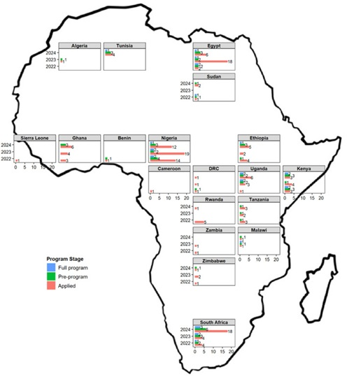
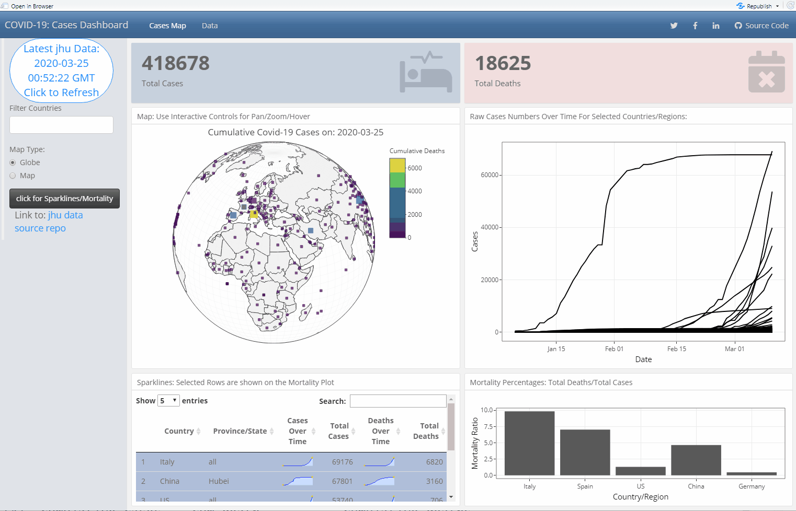

During my journey in pharmacometrics, model-informed drug development and applied data sciences in R, it was rare when I had to produce figures with maps. Yet I love maps, and they can be especially useful to communicate the location of the various clinical trial sites, the places where my students and fellows from the [Africa applied pharmacometrics (APT) training program](https://www.page-meeting.org/wp-content/uploads/pdf_abstracts/10420-abstract.pdf) came from, or the distribution of a disease on the globe.

In this post, I will cover some of the maps that I have done, share the code, the thought process, and show how to re-generate using current tools.

In a previous [blog](https://smouksassi.github.io/posts/surface3d/), I referred to my PAGE 2016 poster: [Primary Microcephaly: Do All Roads Lead to Rome?](https://www.page-meeting.org/pdf_assets/2208-HBGDki-PAGEPoster_v20160520-02Mouksassi.pdf "PAGE 2016 Poster") which not only had a 3D surface but also a map where the countries that were part of the database were highlighted. I reproduce the poster map and another one colored by country specific height-for-age (HAZ) medians. I read in data, compute stat by country, I join the datasets using `joinCountryData2Map` matching by `ISO2` country codes and use the `mapCountryData` function and the `Winkel Tripel` projection:

```{r, webgl=TRUE}
#| message: false
#| warning: false
#| paged-print: true

library(rworldmap) 
library(rworldxtra) 
library(dplyr)
library(sp)
library(ggplot2)
library(sf)
library(dplyr)
library(rnaturalearth) # for map data

HAZSUM <- read.csv("dataedacovabc.csv") %>% 
group_by(COUNTRY) %>%
  summarize(zlenmed = median(zlene,na.rm=T)) 

sPDF <- joinCountryData2Map(HAZSUM,
                            joinCode = "ISO2",
                            nameJoinColumn = "COUNTRY",
                            verbose = TRUE)
par(mai=c(0,0,0.2,0),xaxs="i",yaxs="i")
sPDF <- sPDF[-which(sPDF$ADMIN=="Antarctica"),]
sPDF <- spTransform(sPDF, CRS=CRS("+proj=wintri +ellps=WGS84"))
sPDF$colCode <- 1
sPDF$colCode[ which(sPDF$ADMIN %in% c("Brazil"))] <- 2
sPDF$colCode[ which(sPDF$ADMIN %in% c("Peru","United Republic of Tanzania","South Africa",
                                      "Bangladesh","India","Nepal","Pakistan"))] <- 3

sPDF$colCode[ which(sPDF$ADMIN %in%c("Iraq","Turkey", "Yemen",
                                     "Afghanistan","Cambodia",
                                     "Indonesia","Myanmar", "Philippines","Vietnam",
                                     "Guatemala",
                                     "Chad","Egypt","Sudan","South Sudan",
                                     "Burkina Faso","Ivory Coast","Ghana","Mali","Niger","Nigeria",
                                     "Angola","Cameroon","Democratic Republic of the Congo",
                                     "Burundi","Ethiopia","Kenya","Madagascar","Malawi",
                                     "Mozambique","Rwanda","Uganda","Zambia"))] <- 5

#"United States of America","Canada",

colourPalette <- c("lightgray","orange","red","orange","darkgreen")

mapCountryData( sPDF
                , nameColumnToPlot="colCode"
                , mapTitle="Country Locations Included In the Analysis"
                , colourPalette=colourPalette, catMethod='fixedWidth'
                , addLegend = FALSE)
mapCountryData( sPDF
                , nameColumnToPlot="zlenmed"
                , mapTitle=
                  "Country Locations colored by HAZ Medians"                   , addLegend = FALSE)
```

In another [PAGE poster](https://www.page-meeting.org/wp-content/uploads/pdf_abstracts/10420-abstract.pdf), I presented a map focusing on Africa and highlighting the countries of the fellows using `ggplot2` and `geom_sf` with a Robinson Projection:

```{r}
#| message: false
#| warning: false
#| paged-print: true

APT2023 <- read.csv("APT2023.csv"  )

world_sf <- ne_countries(returnclass = "sf") 
world_sf <- subset(world_sf, admin != "Antarctica") # we don't rly need Antarctica
world_sf <- subset(world_sf, region_un == "Africa") # we don't rly need Antarctica
world_sf$colored <- ifelse(world_sf$name_en %in%  APT2023$Country,
                           "APT","")
# Robinson projection
crs_robin <- "+proj=robin +lat_0=0 +lon_0=0 +x0=0 +y0=0"
# base plot
base <- ggplot() + 
  geom_sf(data = world_sf,  size = 0.2,aes(fill=colored),
          show.legend = FALSE) +
  scale_fill_manual(values=c("transparent","lightgray"))

# world
p1 <- base + theme_minimal() +
  coord_sf(crs = crs_robin)
p1 

```

The most recent paper on the same capacity development program [Advancing pharmacometrics in Africa-Transition from capacity development toward job creation](Advancing%20pharmacometrics%20in%20Africa-Transition%20from%20capacity%20development%20toward%20job%20creation), had a more elaborate Africa map outline and where used `geofacet` to show country specific statistics. Unfortunately `facet_geo` is currently broken and I add another plot that was not in the paper and the Africa map outline which were later combined in PowerPoint.

\*Initial `geofacet` Grid:

```{r}
#| message: false
#| warning: false
#| paged-print: true

library(tidyverse)
library(readxl)
library(geofacet)
library(export)
library(sf)
library(rnaturalearth)
library(rnaturalearthdata)

na_function <- function(x) {
  x[is.na(x)] <- 0 
  return(x)
}
dat <- tibble(Country = "Benin")
for (year in c("2022", "2023", "2024")) {
  datx <- read_excel("APT_Demographics_clean.xlsx", year) %>% 
    filter(`Africa affiliated` == "Yes") %>%
    select(Country, Preprogram, Full_program) %>%
    mutate(Country = if_else(str_detect(Country, "Congo"), "Democratic Republic of Congo", Country), 
           Preprogram = if_else(Preprogram == "Yes", 1, 0),
           Full_program = if_else(Full_program == "Yes", 1, 0)) %>%
    group_by(Country) %>%
    summarize(a = length(Country),
              p = sum(Preprogram),
              e = sum(Full_program))
  y <- colSums(datx[-1])
  message(paste0("In the year ", year, ", ", y[1], ", ", y[2], ", and ", y[3], 
                 " applied, went into the pre-program, and were selected for the full program respectively."))
  colnames(datx) <-  c("Country", paste0(colnames(datx)[-1], year))
  dat <- full_join(dat, datx)
}
dat <- dat %>%
  mutate_at(vars(a2022:e2024), na_function) %>%
  pivot_longer(-Country, names_to = "applied", values_to = "value") %>%
  mutate(status = if_else(str_detect(applied, "a"), "Applied", ""),
         status = if_else(str_detect(applied, "p"), "Pre-program", status),
         status = if_else(str_detect(applied, "e"), "Full program", status),
         applied = gsub("a|e|p", "", applied),
         Year = parse_number(applied),
         label = as.character(value),
         label = if_else(label == "0", "", label)) 
dat <- dat %>%
  mutate(Country2 = case_when(Country == "Benin" ~ "CI", Country == "Cameroon" ~ "CM", Country == "Democratic Republic of Congo" ~ "CG",
                              Country == "Egypt" ~ "EG", Country == "Ethiopia" ~ "ET", Country == "Ghana" ~ "LR",
                              Country == "Kenya" ~ "KE", Country == "Nigeria" ~ "NG", Country == "Rwanda" ~ "RW",
                              Country == "Sierra Leone" ~ "SL", Country == "South Africa" ~ "ZA", Country == "Sudan" ~ "SD",
                              Country == "Tanzania" ~ "TZ", Country == "Uganda" ~ "UG", Country == "Zambia" ~ "ZM",
                              Country == "Zimbabwe" ~ "ZW", Country == "Algeria" ~ "DZ", Country == "Malawi" ~ "MW",
                              Country == "Tunisia" ~ "TN"))
dat <- dat %>% 
  mutate(applied2 = factor(applied),
         value = if_else(value == 0, NA, value), # To stop bars with zero from appearing
         status = factor(status, levels = c("Applied", "Pre-program", "Full program"))) 

to_add <- "  "

similar_numbers <- dat %>%
  select(Country, applied, value, status) %>%
  pivot_wider(names_from = status, values_from = value) %>%
  filter(Applied == `Pre-program` | `Pre-program` == `Full program`)
similar_2022 <- similar_numbers %>% filter (applied == "2022") %>% pull(Country) %>% unique()
similar_2023 <- similar_numbers %>% filter (applied == "2023") %>% pull(Country) %>% unique()
similar_2024 <- similar_numbers %>% filter (applied == "2024") %>% pull(Country) %>% unique()

dat <- mutate(dat, 
              label2 = ifelse(status == "Pre-program" & Year == 2022 &
                               Country %in% similar_2022, paste0(to_add, label), label),
              label2 = ifelse(status == "Pre-program" & Year == 2023 &
                               Country %in% similar_2023, paste0(to_add, label2), label2),
              label2 = ifelse(status == "Pre-program" & Year == 2024 &
                               Country %in% similar_2024, paste0(to_add, label2), label2),
              label2 = ifelse(status == "Applied" & Year == 2023 &
                                Country == "Uganda", paste0(to_add, label2), label2))

grid_preview("africa_countries_grid1")

```

\*Trimmed down `geofacet` Grid:

```{r}
#| message: false
#| warning: false
#| paged-print: true
#| 
my_grid <- africa_countries_grid1
my_grid <- my_grid[my_grid$code %in% unique(dat$Country2),]
my_grid$name[my_grid$code == "LR"] <- "Ghana"
my_grid$name[my_grid$code == "CI"] <- "Benin"
my_grid$name[my_grid$code == "CG"] <- "DRC"
my_grid$col[my_grid$code == "EG"] <- 5
my_grid$col[my_grid$code == "SD"] <- 5
my_grid$row[my_grid$code == "UG"] <- 5
my_grid$col[my_grid$code == "ET"] <- 6
my_grid$col[my_grid$code == "RW"] <- 5
my_grid$col[my_grid$code == "TZ"] <- 6
my_grid$col[my_grid$code == "ZW"] <- 5
my_grid$row[my_grid$code == "NG"] <- 3
my_grid$col[my_grid$code == "NG"] <- 4
my_grid$row[my_grid$code == "NG"] <- 4
my_grid$col[my_grid$code == "DZ"] <- 2
my_grid$col[my_grid$code == "TN"] <- 3
grid_preview(my_grid)
```

\*Bugged `geofacet` Plot:

```{r}
#| message: false
#| warning: false
#| paged-print: true

ggplot(dat, aes(applied2, value, fill = status)) +
  geom_col(position = position_dodge(width = 0.9, preserve="single"), alpha = 1) +
  coord_flip() +
  theme_bw() +
  facet_geo(~ Country2, grid = my_grid, label = "name") + 
  geom_text(aes(applied2, value, label = label2), hjust = 0, 
            size = 2.7, position = position_dodge(width = 0.9)) +
  theme_bw() +
  theme(axis.text = element_text(size = 9, color = "black"),
        axis.title = element_blank(),
        legend.title = element_text(size = 10, face = "bold"),
        legend.text = element_text(size = 10),
        strip.text = element_text(size = 9, color = "black", face = "bold", margin = margin(0.05,0,0.05,0, "cm")),
        panel.grid.major = element_blank(), 
        panel.grid.minor = element_blank(),
        legend.position = c(0.15, 0.3)
  ) +
  scale_y_continuous(breaks = seq(from = 0, to = 20, by = 5), limits = c(0, 21)) +
  guides(fill = guide_legend(reverse = TRUE)) +
  labs(fill = "Program Stage")
```

\*Alternative `geom_text/facet_wrap` plot:

```{r}
#| message: false
#| warning: false
#| paged-print: true

ggplot(dat, aes(x=as.factor(Year), status, fill = status)) +
  geom_text(aes(label=value,size=value,color=status),
            show.legend =  c(size = FALSE, color = TRUE) )+
  facet_wrap(~ reorder(as.factor(Country),value),ncol=5)+
  scale_size(range = c(3,8))+
  labs(x="",y="")+
  theme_bw() +
  theme(axis.text = element_text(size = 9, color = "black"),
        axis.title = element_blank(),
        legend.title = element_text(size = 10, face = "bold"),
        legend.text = element_text(size = 10),
        strip.text = element_text(size = 9, color = "black", face = "bold",          margin = margin(0.05,0,0.05,0, "cm")),
        panel.grid.major = element_blank(), 
        panel.grid.minor = element_blank(),
        legend.position = "inside",
        legend.position.inside =  c(0.9, 0.1))+
  guides(fill = guide_legend(reverse = TRUE))

```

\*Africa outline plot:

```{r}
#| message: false
#| warning: false
#| paged-print: true

world <- ne_countries(scale = "medium", returnclass = "sf")
africa <- world[world$continent == "Africa", ]
africa_boundary <- st_union(africa) # Combine all African countries into a single boundary (dissolve boundaries)
afr <- ggplot() +
  geom_sf(data = africa_boundary, fill = NA, color = "black", linewidth = 0.8) +
  theme_void() 
afr
```

For context this was the plot that was included in the paper:



When the COVID-19 pandemic started, there were several live dashboards floating around and I wanted to challenge my dashboarding/R Shiny skills building my own.

This how I produced the `plotly` 3D globe using the last data snapshot I could find on github:

```{r}
#| message: false
#| warning: false
#| paged-print: true
library(plotly)
library(data.table)

alldata <- fread("alldata.csv")
alldata$countryprovince <-
  paste(alldata$country_region, alldata$province)
alldatalastpoint <- alldata %>%
    group_by(country_region, province, countryprovince) %>%
    slice(n())

colorlimits <- c(0, max(alldata$cumulative_deaths) + 10)

g <- list(
  projection    = list(type = "orthographic"),
  fitbounds     = "locations",
  showland      = TRUE,
  showlakes     = FALSE,
  showrivers    = FALSE,
  landcolor     = toRGB("gray95"),
  subunitcolor  = toRGB("gray85"),
  countrycolor  = toRGB("black"),
  countrywidth  = 0.5,
  subunitwidth  = 0.5,
  showsubunits  = TRUE,
  showcountries = TRUE,
  resolution = 110,
  lonaxis    = list(
    showgrid = TRUE,
    gridwidth = 0.5,
    dtick = 5
  ),
  lataxis    = list(
    showgrid = TRUE,
    gridwidth = 0.5,
    dtick = 5
  )
)

plot_geo(alldatalastpoint, lat = ~ Lat, lon = ~ Long) %>% add_markers(
  text = ~ paste(
    country_region,
    ifelse(province == "NA", "", province),
    paste0("Cases:", cumulative_cases),
    paste0("Deaths:", cumulative_deaths),
    sep = "<br />"
  ),
  symbol = I("square"),
  size = ~ cumulative_cases ,
  color = ~ (cumulative_deaths + 0.0001),
  hoverinfo = "text"
) %>% plotly::layout(
  title = paste('Cumulative Covid-19 Cases'),
  geo = g
) %>% 
  colorbar(title = "Cumulative Deaths",
           limits = colorlimits)

  
```

Another nice feature was the table that had sparklines and reproduced below:

```{r}
#| message: false
#| warning: false
#| paged-print: true
library(DT)
library(sparkline)
library(htmlwidgets)
staticRender_cb <-
  htmlwidgets::JS('function(){HTMLWidgets.staticRender();}')
#getDependency('sparkline')

cases_sparkline_data <- alldata
keycols = c("countryprovince", "country_region", "province", "Date")
setkeyv(cases_sparkline_data, keycols)
cases_sparkline_data <- cases_sparkline_data[
  , .(cum_cases = spk_chr(cumulative_cases, type = "line"),
      cum_death = spk_chr(cumulative_deaths, type = "line") ),
by = .(countryprovince, country_region, province)]

datasparkline <- merge(alldatalastpoint,
  cases_sparkline_data,
  by = c("countryprovince", "country_region", "province")
)
datasparkline <-  datasparkline[, c("country_region", "province",
               "cum_cases",
               "cumulative_cases",
               "cum_death",
               "cumulative_deaths")]

  df<- as.data.frame(datasparkline)
   DTsparkline <-  suppressMessages(spk_add_deps(
      datatable(
        df %>% 
          arrange(desc(cumulative_cases),
                  desc(cumulative_deaths)),
        filter = 'none',
        escape = FALSE,
        selection = list(
          target = "row",
          mode = 'multiple',
          selected = c(1,2,3,4,5)
        ),
        extensions = c('Select'),
        options = list( dom = 'lfrtiBp',
          pageLength = 5 ,
          lengthMenu = list(c(5, 10, 15,-1),
                       c('5', '10', '15', 'All')),
              autoWidth = FALSE,
          scrollX = TRUE,
          scrollY = TRUE,
          target = 'row',
          drawCallback   = staticRender_cb,
          fnDrawCallback = staticRender_cb,
          #order = list(list(4, 'desc'), list(6, 'desc')),
          columns = list(
            list(title = ''),
            list(title = 'Country'),
            list(title = 'Province/State'),
            list(title = 'Cases Over Time'),
            list(title = 'Total Cases'),
            list(title = 'Deaths Over Time'),
            list(title = 'Total Deaths')
          )))))
   DTsparkline

```
Have a look at the dashboard source code, if you want to see how cross filtering and interactivity were handled. A gif animation of how this dashboard looked like in 2020 is shown below. It had interactive filters, the map with a 3D/2D projection. Cross-filtering between widgets and sparklines.



The repo lives [here](https://github.com/smouksassi/covid19dashboard) but note that some links to publicly available databases at the time might be broken.

In the blog, I have shared my experience with maps, dashboards, interactivity via Shiny, Plotly, htmlwidgets, sparklines and DT interactive tables. Have you used advanced interactivity in your Dashboards? Maps? what is your go to solution/service provider?
