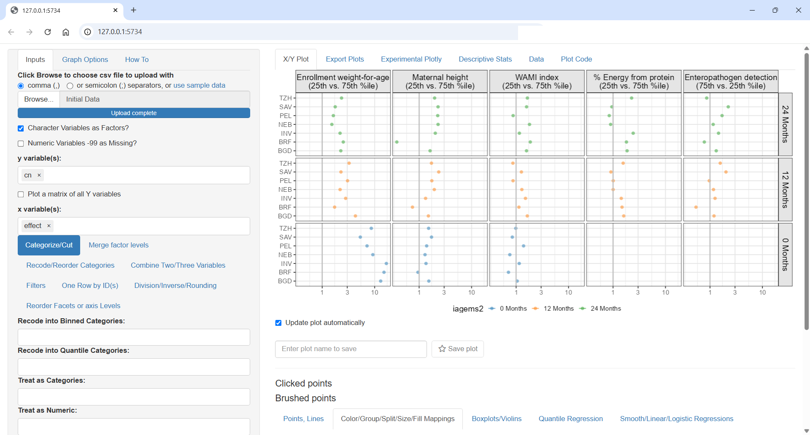
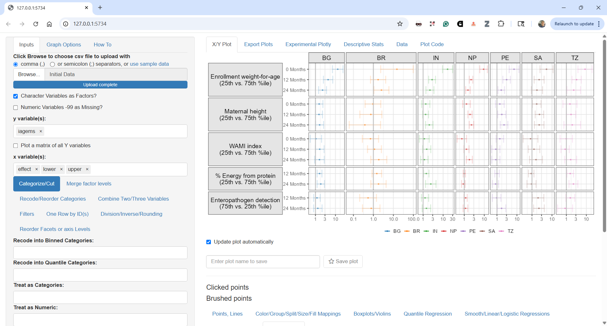
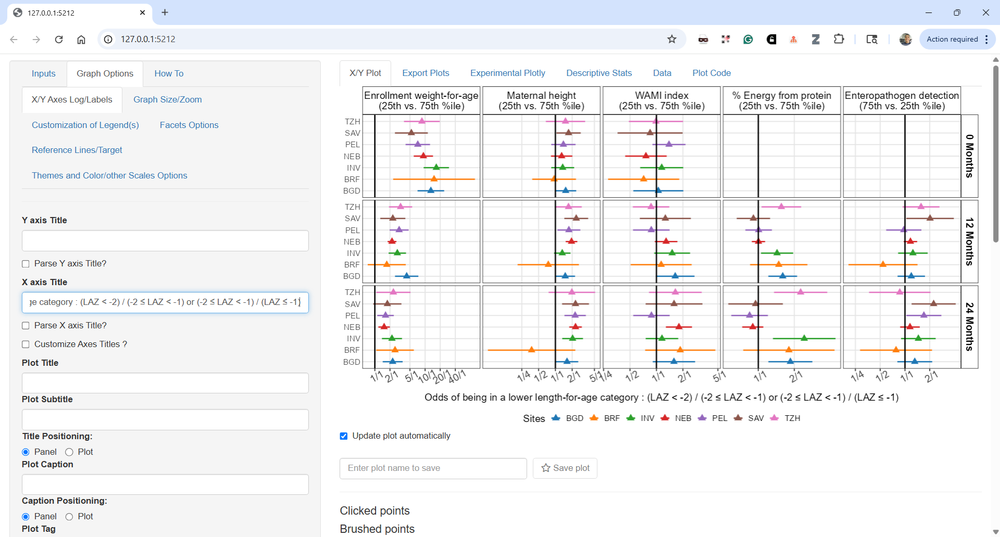

This week, in my post I will revisit one of my 2017 papers entitled [Childhood stunting in relation to the pre- and postnatal environment during the first 2 years of life: The MAL-ED longitudinal birth cohort study](https://journals.plos.org/plosmedicine/article?id=10.1371/journal.pmed.1002408 "MAL-ED Network Investigators") The study was focused on characterizing factors that contribute to stunting in resource-poor settings, and included a priori selected biological and social factors collected longitudinally in a cohort of newborns in seven sites: Bangladesh, Brazil, India, Nepal, Peru, South Africa, and Tanzania.

The data included longitudinal anthropometry, sociodemographic factors, maternal-reported illnesses, and antibiotic use; child feeding practices; dietary intake starting at 9 months; and longitudinal blood, urine, and stool samples to investigate non-diarrheal enteropathogens, micronutrients, gut inflammation and permeability, and systemic inflammation. The length-for-age *Z*-scores (LAZ) was categorized into 3 groups (not stunted, ≥−1; at risk, \<−1 to −2; and stunted, \<−2), and used multivariable ordinal logistic regression to model the cumulative odds of being in a lower length-for-age category (at risk or stunted). The goal of this post is to show how this model was communicated, share code that would allow you to reproduce the paper figures and propose some alternatives. For complete details refer to the paper and the shared code that came with it.

A common problem when analyzing longitudinal data with time varying covariates changing over the course of the trial is how to analyze it properly and how to compute and report meaningful odds ratios (ORs). The model code was the following :

```{r}
#| eval: false
#| message: false 
#| warning: false
#| paged-print: true   
#| code-fold: false

library(rms)
d <- datadist(data)
options(datadist="d")

model = lrm ( zlencat ~ lsp(agemonths,c(6,12,18))*(
  ma0fe1+ 	
    zwei_enroll+
    mafht+
    pathscoretotf+
    mean_wami+
    Country_ID+
    mean_hb_adj+
    mean_rarconc+ 
    mean_adjfar+ 
    mean_fsq+
    lmz+ 
    mpo+
    neo+
    ala+ 
    mean_agpval1+
    p_dprev3_cumtot+
    p_alri_cumtot+
    p_saffev_cumtot+
    dalri_cumtot+
    ddiar_cumtot+ 
    p_safab_cumtot+
    p_breastfeed_cumtot
)+
  ageabove9mo*(
    sumkcalcum+
      sumprocum),
x=T,y=T, data = data, tol=1e-8) 

finalmodel = robcov ( model , cluster = data$id )

```

The `lrm` function from the excellent `rms` package is used as it allows using flexible linear splines with `lsp` with prespecified knots at 6, 12 and 18 months, interaction between age and predictors as well as accounting for portein and caloric intake above 9 months. The `robcov` function allows to adjust the model standard errors by declaring the cluster as the subject `id`. While the `rms` package has automatic `summary` and `plot` methods that produce forest plots it does not take into account the time varying nature of covariate nor the longitudinal nature of the data. We opted to compute the odds ratios at 0, 12 and 24 months using the overall (pooled) model as well as using fits by individuals sites. We computed the interquartile cumulative ORs for continuous variables, i.e., the ratio of odds between the 25th and 75th percentiles or between the 75th and 25th percentiles of the risk factor, at the specific time point, depending on the direction that indicated worse exposure. This is the default in `rms` and the rationale is that this would represent the ORs around 50% of the data. The paper Figure 4 had a customized forest plot that included the top 5 risk factors overall side by side with the by site ORs:

```{r}
#| message: false
#| warning: false
#| paged-print: true
#| fig-height: 5
#| fig-width: 12

library(tidyr)
library(dplyr)
require(ggplot2 )
library(patchwork)
library(ggquickeda)

Figure4 <- read.csv("Figure4.csv")
Figure4$name <- reorder (Figure4$name,- Figure4$pool_effect)
Figure4$iagems = with(Figure4, factor(iagems, levels = rev(levels(as.factor(iagems)))) )

Figure4pooled <- Figure4 %>% 
  mutate(iagems2=iagems) %>% 
  distinct(name,iagems,iagems2,pool_effect,pool_lower,pool_upper)
Figure4pooled$iagems2 <- forcats::fct_rev(as.factor(Figure4pooled$iagems))


ppooled<- ggplot (Figure4pooled,aes(pool_effect,iagems,xmin=pool_lower,xmax=pool_upper))+
  geom_vline(xintercept=1)+
  geom_linerange(position=position_dodge(width=0.70),aes(color=iagems2),
                 show.legend=TRUE) +
  geom_point(position=position_dodge(width=0.70),aes(color=iagems2),size=3,shape=15)+
  facet_grid(name~., switch = "y",scales="free_y" , space="free" )+
  scale_x_continuous(trans = "log",breaks = c(0.25,0.5,1,2,5,10,20),
                     labels=c("1/4","1/2","1/1","2/1","5/1","10/1","20/1"))+ 
  scale_color_manual(values = c("#737373","#4292C6","#EF3B2C"),
                     name="All Sites (filled square)\n95% CI (horizontal line)") +
  theme_bw(base_size = 14)+
  theme(axis.ticks.y=element_blank(),axis.text.y.left = element_blank(),
        strip.text.y.left = element_text(size = 12, colour = "black", angle = 0,hjust = 1),
        strip.background = element_rect(colour = 'transparent',fill="white"),
        legend.position="top",legend.key = element_rect(linetype=0),
        legend.title=element_text(size=6) ,
        legend.text = element_text( size = 6),
        axis.title.y = element_blank())+
  xlab("Odds of being in a lower length-for-age category")+
  coord_cartesian(xlim = c(0.25,20))


Figure4$iagems2 <- forcats::fct_rev(as.factor(Figure4$iagems))

pindividual <- ggplot (Figure4,aes(effect,iagems))+
  geom_vline(xintercept=1)+
  geom_point(aes(color=iagems2),size=3,shape=17) +
  facet_grid(name~., switch = "y",scales="free_y" , space="free" )+
  scale_x_continuous(trans = "log",breaks = c(0.25,0.5,1,2,5,10,20),
                     labels=c("1/4","1/2","1/1","2/1","5/1","10/1","20/1"))+ 
  scale_color_manual(values = c("#737373","#4292C6","#EF3B2C"),
                     name="Individual Sites (filled triangle)") +
  theme_bw(base_size = 14)+
  theme(axis.ticks.y=element_blank(),axis.text.y.left = element_blank(),
        strip.background = element_blank(),strip.text = element_blank(),
        legend.position="top",legend.key = element_rect(linetype=0),
        legend.title=element_text(size=6) ,
        legend.text = element_text( size = 6),
        axis.title.y = element_blank())+
  xlab("Odds of being in a lower length-for-age category")+
  coord_cartesian(xlim = c(0.25,20))
(ppooled | pindividual) +
  plot_layout(axis_titles = "collect_x")+
  plot_annotation(tag_levels = 'A')

```

From this visual, we can appreciate how the ORs change over time, for example the enrollment weight-for-age is \> 10 at births and its impact taper down over the two years of life. Other risk factors such as sanitation represented by the WAMI index have cumulative impact and the ORs grow over time. On the right we see the individual sites estimates we can appreciate the site to site variability, the weird diverging triangles for Maternal height, the bi-modal site effects for % Energy from protein.

Then came the important request from a major stake holder: can you show the individual sites with identifying labels and associated 95% CI ?

How would you go about re-working the plot to answer these questions ? `Figure4.csv` is provided in the repo so you can do your wn tests and come up with ideas on how to represent the data !

On my end for such tasks, I fire up my `ggquickeda` package to find interesting ways to show the data and answer design questions on the fly:

-   Should we put Ste/Country on the y axis ?

-   Should we color by age/Months or Site

-   Should we row or column split by risk factor ?

```{r}
#| eval: false
#| message: false 
#| warning: false
#| paged-print: true   
#| code-fold: false
ggquickeda::run_ggquickeda(Figure4)
```

`ggquickeda::run_ggquickeda(yourdata)` launch a `ggplot2` R shiny interface with the R data loaded here is some snapshots from my tests:





Each detail, label and ordering is important. Should time increase top to bottom or bottom to top ? What order for covariates makes sense? Strongest to lowest? Overall or at specific time point? How to order countries by geographies or by worst outcomes?

The next plot is close to what ended up in the paper as Figure 5:



I could customize the plot more using the `ggquickeda` interface, change the legend number of columns or text but for such tasks I prefer to go directly into the code which I share next and which shows the near final Figure 5. The pooled estimates are shown as black vertical lines and 95% CIs as colored areas matching the colors from the previous Figure 4. In this way, we can directly compare the individual estimates to the pooled and we can follow each site across panels as the colore is by site. For example we can now clearly see that the diverging country in Maternal height ORs was Brazil.

```{r,dev='ragg_png'}
#| message: false
#| warning: false
#| paged-print: true
#| fig-height: 7
#| fig-width: 9

ggplot(Figure4, aes(x = effect, y =cn ,xmin = lower, xmax = upper)) +
    geom_rect(data=Figure4pooled,
              aes(xmin = pool_lower, xmax = pool_upper,fill=as.factor(iagems2)),
              ymin=-Inf,ymax= Inf,alpha=0.5,col=NA,inherit.aes = FALSE)+
geom_vline(data=Figure4pooled,aes(xintercept = pool_effect,
                                    linetype=as.factor(iagems2)),size=1,alpha=0.5 ) + geom_vline(xintercept = 1,col="red",size=1) +
  geom_pointrange(aes(col=cn),size=0.5,shape=24,fill="white") +
  facet_grid( iagems2 ~name,scales = "free_x") +
  scale_x_continuous(trans = "log", minor_breaks = NULL,
                     breaks = c(0.25, 0.5, 1, 2, 5, 10, 20,40),
                     labels = c("1/4", "1/2", "1/1", "2/1", "5/1", "10/1", "20/1","40/1"))+
  scale_fill_manual(values = c("#B5B5B5","#9BC5E1","#E98981" ) ,
                    name= "Overall Effects (vertical line)\n 95% CI (colored area)")+
  scale_linetype_manual(values = c("solid","solid","solid") ,
                        name= "Overall Effects (vertical line)\n 95% CI (colored area)")+
  scale_linetype_manual(values = c("solid","solid","solid") ,
                        name= "Overall Effects (vertical line)\n 95% CI (colored area)")+
  guides(fill = guide_legend(order=1,ncol=2),
         col = guide_legend(title="By Site Effects (triangle)\n 95% CI (horizontal line)",ncol = 4),
         linetype =guide_legend(order=1))+
  theme_bw(base_size = 12)+
  theme(panel.spacing = unit(0.5, "lines"),
        legend.position = "bottom",legend.box = "horizontal",
        strip.text = element_text(size = 10),
        axis.text.x= element_text(angle = 30),
        strip.background = element_rect(colour = 'transparent',fill="transparent"),
        axis.title.y.left = element_blank(),
        legend.key = element_rect(linetype=0),legend.key.width=unit(1.2,"line") ,
        legend.title=element_text(size=10) ,
        legend.text = element_text( size = 8),)+
  xlab("Odds of being in a lower length-for-age category : (LAZ < -2) / (-2 \u2264 LAZ < -1) or (-2 \u2264 LAZ < -1) / (LAZ \u2265 -1)") 

```

In the paper I have used the `export` package to export the ggplot object into editable PowerPoint where I could edit the labels and tweak some final aesthetics like having the text for the Months row facets underlined. While this is possible in `ggtext` editable objects open limitless possibilites including custom PowerPoint animations.

Can we improve this plot further? How about the values a forest plots usually include a side table with the values. Can we remove the empty panels?

The `ggh4x` package has a function `facet_grid2( ..., render_empty = FALSE)` which help in removing the panels without data. An attempt to label the data using `ggrepel` is made:

```{r,dev='ragg_png'}
#| message: false
#| warning: false
#| paged-print: true
#| fig-height: 7
#| fig-width: 9

library(ggh4x)
library(ggrepel)

ggplot(Figure4, aes(x = effect, y =cn ,xmin = lower, xmax = upper)) +
  geom_rect(data=Figure4pooled,
            aes(xmin = pool_lower, xmax = pool_upper,fill=as.factor(iagems2)),
            ymin=-Inf,ymax= Inf,alpha=0.5,col=NA,inherit.aes = FALSE)+
  geom_vline(data=Figure4pooled,aes(xintercept = pool_effect,
                                    linetype=as.factor(iagems2)),size=1,alpha=0.5 ) +
  geom_vline(xintercept = 1,col="red",size=1) +
  geom_pointrange(aes(col=cn),size=1,fatten = 2,shape=24,fill="white") +
  geom_text_repel(aes(col=cn,x=effect,y=cn,label=table1::round_pad(effect,digits = 1)),
                  nudge_y = -0.3,hjust = 0.5,size=3,direction="x")+
  geom_text_repel(aes(col=cn,x=lower,y=cn,label=table1::round_pad(lower,digits = 1)),
                  nudge_y = -0.3,hjust =0,size=3,direction="x")+
  geom_text_repel(aes(col=cn,x=upper,y=cn,label=table1::round_pad(upper,digits = 1)),
                  nudge_y = -0.3,hjust = 1,size=3,direction="x")+
  
  
  facet_grid2( iagems2 ~name,scales = "free_x", render_empty = FALSE)+
  scale_x_continuous(trans = "log", minor_breaks = NULL,
                     breaks = c(0.25, 0.5, 1, 2, 5, 10, 20,40),
                     labels = c("1/4", "1/2", "1/1", "2/1", "5/1", "10/1", "20/1","40/1"))+
  scale_fill_manual(values = c("#B5B5B5","#9BC5E1","#E98981" ) ,
                    name= "Overall Effects (vertical line)\n 95% CI (colored area)")+
  scale_linetype_manual(values = c("solid","solid","solid") ,
                        name= "Overall Effects (vertical line)\n 95% CI (colored area)")+
  scale_linetype_manual(values = c("solid","solid","solid") ,
                        name= "Overall Effects (vertical line)\n 95% CI (colored area)")+
  guides(fill = guide_legend(order=1,ncol=2),
         col = guide_legend(title="By Site Effects (triangle)\n 95% CI (horizontal line)",ncol = 4),
         linetype =guide_legend(order=1))+
  theme_bw(base_size = 12)+
  theme(panel.spacing = unit(0.5, "lines"),
        legend.position = "bottom",legend.box = "horizontal",
        strip.text = element_text(size = 10),
        axis.text.x= element_text(angle = 30),
        strip.background = element_rect(colour = 'transparent',fill="transparent"),
        axis.title.y.left = element_blank(),
        legend.key = element_rect(linetype=0),legend.key.width=unit(1.2,"line") ,
        legend.title=element_text(size=10) ,
        legend.text = element_text( size = 8),)+
  xlab("Odds of being in a lower length-for-age category : (LAZ < -2) / (-2 \u2264 LAZ < -1) or (-2 \u2264 LAZ < -1) / (LAZ \u2265 -1)") 

```

Finally I try yet another way to show the data and to add a `path` to follow the OR's over time:

```{r,dev='ragg_png'}
#| message: false
#| warning: false
#| paged-print: true
#| fig-height: 7
#| fig-width: 9

ggplot(Figure4 %>% 
         arrange(country,iagems2), aes(x = effect, y =iagems2 ,xmin = lower, xmax = upper)) +
  facet_grid2( cn ~name,scales = "free_x", render_empty = FALSE)+
  scale_x_continuous(trans = "log", minor_breaks = NULL,
                     breaks = c(0.1,0.25, 0.5, 1, 2, 5, 10, 20,40),
                     labels = c("1/10","1/4", "1/2", "1/1", "2/1", "5/1", "10/1", "20/1","40/1"))+
  geom_rect(data=Figure4pooled,
            aes(xmin = pool_lower, xmax = pool_upper,fill=as.factor(iagems2)),
            ymin=-Inf,ymax=Inf,alpha=0.5,col=NA,inherit.aes = FALSE)+
  geom_vline(data=Figure4pooled,aes(xintercept = pool_effect,color=as.factor(iagems2),
                                    linetype=as.factor(iagems2)),size=1,alpha=0.9 ) +
  geom_pointrange(aes(col=iagems2),size=1,fatten = 2,shape=24,fill="white") +
  geom_path(aes(group=cn),col="black",
            arrow =  arrow(length = unit(0.1, "npc")
            ),  lineend = c('round'),
            linejoin = c('mitre'))+
  geom_text(aes(col=iagems2,x=effect,y=iagems2,label=table1::round_pad(effect,digits = 1)),
            nudge_y = -0.4,hjust = 0.5,size=3,direction="x",fontface = "bold")+
  geom_text(aes(col=iagems2,x=lower,y=iagems2,label=table1::round_pad(lower,digits = 1)),
            nudge_y = -0.4,hjust =1,size=3,direction="x",fontface = "bold")+
  geom_text(aes(col=iagems2,x=upper,y=iagems2,label=table1::round_pad(upper,digits = 1)),
            nudge_y = -0.4,hjust = 0,size=3,direction="x",fontface = "bold")+
  scale_fill_manual(values = c("#B5B5B5","#9BC5E1","#E98981" ) ,
                    name= "Individual Site Effects | 95%CI (triangles and lines)\nOverall Effects | 95%CI (vertical lines and colored areas)",
                    guide = guide_legend(reverse = FALSE))+
  
  scale_color_manual(values = c("#B5B5B5","#9BC5E1","#E98981" ) ,
                     name= "Individual Site Effects | 95%CI (triangles and lines)\nOverall Effects | 95%CI (vertical lines and colored areas)",
                     guide = guide_legend(reverse = FALSE))+
  scale_linetype_manual(values = c("solid","solid","solid") ,
                        name= "Individual Site Effects | 95%CI (triangles and lines)\nOverall Effects | 95%CI (vertical lines and colored areas)",
                        guide = guide_legend(reverse = FALSE))+
  xlab("Odds of being in a lower length-for-age category : (LAZ < -2) / (-2 \u2264 LAZ < -1) or (-2 \u2264 LAZ < -1) / (LAZ \u2265 -1)") +
  ylab("") +
  theme_bw(base_size = 12) +
  theme(panel.spacing = unit(0.5, "lines")) +
  theme(legend.position = "bottom",legend.box = "horizontal")+
  theme(text = element_text(size=12),
        strip.text = element_text(size = 10),
        strip.text.y.right = element_text(angle=0),
        axis.text.x= element_text(angle = 30))+
  theme(strip.background = element_rect(colour = 'transparent',fill="transparent"))+
  theme(legend.key = element_rect(linetype=0),legend.key.width=unit(1.2,"line"),
        axis.title.y.left = element_blank())+
  theme(legend.position = "bottom",legend.box = "horizontal",
        legend.title=element_text(size=10) ,
        legend.text = element_text( size = 8))+
  xlab("Odds of being in a lower length-for-age category : (LAZ < -2) / (-2 \u2264 LAZ < -1) or (-2 \u2264 LAZ < -1) / (LAZ \u2265 -1)") +
  coord_cartesian(clip="off")

```

As always, please reach out on LinkedIn or github to propose your ideas and continue the discussion !
