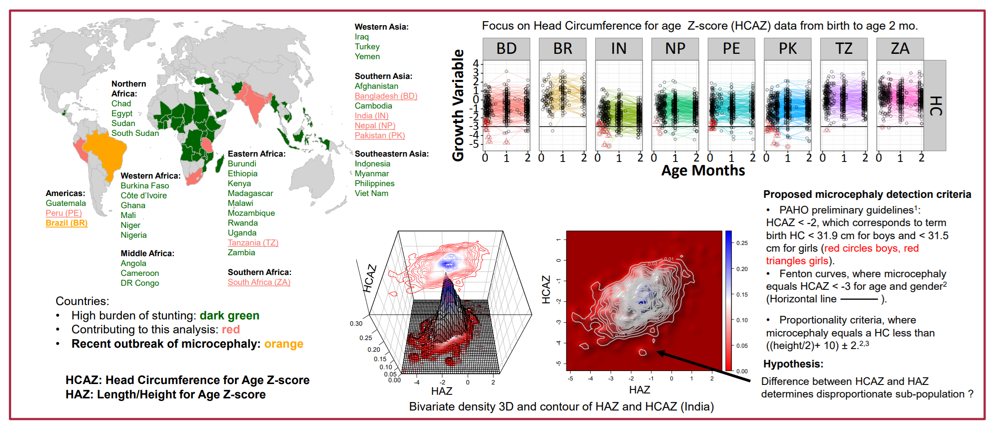
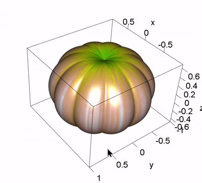

While at ACOP 2025, one of the posters on Pirana AI automated machine learning had a nice 3D plot showing a representation of the fitness functions based on three dimensional objective functions. The conversation led me to recall a 3D plot I made for a PAGE 2016 poster: [Primary Microcephaly: Do All Roads Lead to Rome?](https://www.page-meeting.org/pdf_assets/2208-HBGDki-PAGEPoster_v20160520-02Mouksassi.pdf "PAGE 2016 Poster")



In this post, I will revisit the 3D visualization techniques used in this poster with a surprise at the end! First generating a static plot after computing the density wiht `bkde2D`.

```{r, webgl=TRUE}
#| message: false
#| warning: false
#| paged-print: true
library(tidyr)
library(dplyr)
library(scales)
require(MASS)
require(KernSmooth )
require(ggplot2 )
library(plotly)
library(patchwork)
library(ggquickeda)
library(rgl)
options(rgl.useNULL = TRUE) # Suppress the separate window.
knitr::knit_hooks$set(webgl = hook_webgl)
library(plot3Drgl)
rgl::setupKnitr(autoprint = TRUE)


 options(ggplot2.discrete.colour =
           list(c( "#4682AC","#FDBB2F","#EE3124" ,"#336343","#7059a6", "#803333")))
  options(ggplot2.discrete.fill =
           list(c( "#4682AC","#FDBB2F","#EE3124" ,"#336343","#7059a6", "#803333"))) 
  

dataplot<- read.csv("dataplot.csv")

x <- cbind(dataplot$haz, dataplot$hcaz)
est <- bkde2D(x, bandwidth=c(0.1, 0.1))

persp3D(x=est$x1,y= est$x2,z = est$fhat,   col = ramp.col(c("red","white", "blue")),
        border = "black",zlim=c(-0,0.3), xlab="HAZ",ylab="HCAZ",zlab="",
        ticktype = "detailed", bty = "b2",theta=0,phi=50,
        colkey = FALSE, lighting = TRUE, lphi = 90,
        clab = c("","density",""))

contour3D(x=est$x1,y=est$x2,z = 0, colvar = est$fhat, add = TRUE,nlevels = 20,
          col = ramp.col(c("red","white", "blue")),      plot = TRUE,colkey=FALSE
)
contour3D(x=est$x1,y=est$x2,z = 0.3, colvar = est$fhat, add = TRUE,nlevels = 20,
          col = ramp.col(c("red","white", "blue")),      plot = TRUE,colkey=FALSE
)

```

And using Quarto's `webgl = TRUE` and `plotrgl` to generate an interactive 3D one.

```{r, webgl=TRUE}
#| message: false
#| warning: false
#| paged-print: true

plotrgl(new = FALSE)

```

A more modern implementation using `plotly`:

```{r}
#| message: false
#| warning: false
#| paged-print: true

custom_colorscale <- list(
  list(0.0, "transparent"), 
  list(0.001, "rgb(255,255,255)"), 
  list(1.0, "rgb(0,0,139)") 
)

p <- plot_ly(x = est$x1, y = est$x2, z = est$fhat/max(est$fhat)) %>%
  add_surface(
    opacity = 0.3,  # Make the surface semi-transparent
    colors = ramp.col(c("red","white", "blue")),
    #colorscale = custom_colorscale,
    contours = list(
      z = list(
        show = TRUE,
        usecolormap = TRUE,
        highlight = TRUE,
        highlightcolor ="black",
        start = 0.01,end   = 1, size = 0.02 ,
        project = list(z = TRUE),
        line = list( width = 0,color = "black")
      ),
      x = list(show = TRUE,highlight = FALSE),
      y = list(show = TRUE, highlight = FALSE)
    )
  ) %>%
  layout(title = "Bivariate HCAZ HAZ Estimate",
         scene = list(
           eye = list(x = -1.25, y = 1.25, z = 1.25),
           bgcolor = "rgb(244, 244, 248)" ,
           xaxis = list(title = "haz"),
           yaxis = list(title = "hcaz"),
           zaxis = list(title = "Density",
                        range=c(-0.8,1.2) ) ))


plane_data1 <- data.frame(
  x = rep(c(-5.186198,2.477165), each = 2),
  y = rep(c(-5.186198,2.477165), times = 2),
  z = rep(-1, 4)
)
plane_data2 <- data.frame(
  x = rep(c(-5.186198,2.477165), each = 2),
  y = rep(c(-5.186198,2.477165), times = 2),
  z = rep(1.2, 4)
)


x_const <- -2
y_plane <- seq(-5.186198, 2.477165 , length.out = 10)
z_plane <- seq(-0.5, 1.2, length.out = 10)
x_matrix <- matrix(x_const,
                   nrow = length(y_plane),
                   ncol = length(z_plane))

y_const <- -3
x_plane <- seq(-5.186198, 2.477165 , length.out = 10)
z_plane <- seq(-0.5, 1.2, length.out = 10)
y_matrix <- matrix(y_const,
                   nrow = length(x_plane),
                   ncol = length(z_plane))


p <- p  %>%
  add_surface(
    x = x_matrix,
    y = matrix(y_plane, nrow = 10, ncol = 10, byrow = FALSE),
    z = matrix(z_plane, nrow = 10, ncol = 10, byrow = TRUE),
    opacity = 0.1,
    showscale = FALSE,
    showscale = FALSE,
    inherit = FALSE ,
    #colorscale = "Greys",
    colors = "blue",
    name = paste("Section at HAZ =", x_const)
  ) %>%
  add_surface(
    x = matrix(x_plane, nrow = 10, ncol = 10, byrow = FALSE),
    y = y_matrix ,
    z = matrix(z_plane, nrow = 10, ncol = 10, byrow = TRUE),
    opacity = 0.1,
    showscale = FALSE,
    showscale = FALSE,
    inherit = FALSE ,
    colors = "blue",
    name = paste("Section at HCAZ =",y_const)
  )

p

```

Today is Halloween ! Boo ! 



```{r}
#| message: false
#| warning: false
#| paged-print: true

#https://stackoverflow.com/questions/74341935/how-to-create-a-matlab-pumpkin-in-r

sphere <- function(n) {
  dd <- expand.grid(theta = seq(0, 2*pi, length.out = n+1),
                    phi = seq(-pi/2, pi/2, length.out = n+1))
  with(dd, 
       list(x = matrix(cos(phi) * cos(theta), n+1),
            y = matrix(cos(phi) * sin(theta), n+1),
            z = matrix(sin(phi), n+1))
  )
}

sph <- sphere(200)
X <- sph[[1]]
Y <- sph[[2]]
Z <- sph[[3]]

R <- 1 - (1 - seq(from=0, to=20, by=0.1) %% 2) ^ 2 / 12 
R2 <- 0.8 + (0 - seq(from=1, to=-1, by=-0.01)^4)*0.2 

x <- R * X 
y <- R * Y 
z <- t(R2 * t(Z)) 

hypot_3d <- function(x, y, z) {
  return(sqrt(x^2 + y^2 + z^2))
}
c_ <- hypot_3d(x,y,z) + rnorm(201) * 0.03
color_palette <- terrain.colors(20) 
col <- color_palette[ as.numeric(cut(c_, breaks = 20)) ] 

persp3d(x, y, z, color = col, aspect=FALSE)

```

If you have any questions feel free to contact me on [github](https://github.com/smouksassi/ggquickeda/issues "submit issues").


