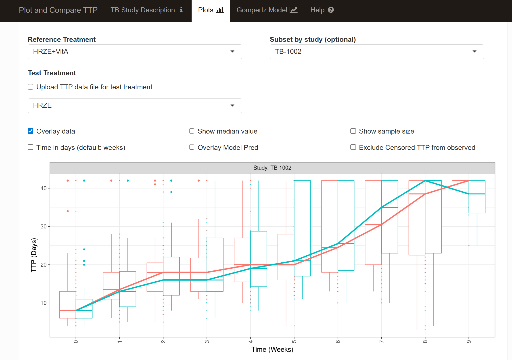
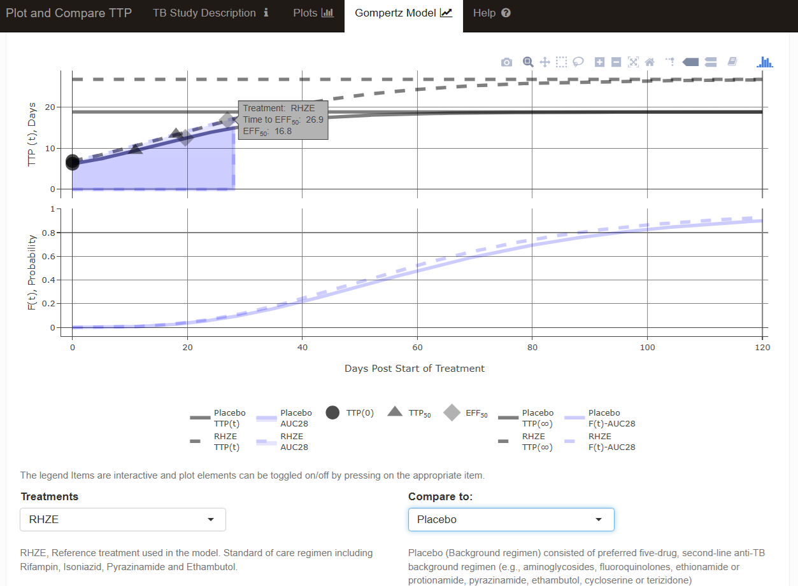

A while back, I did a consulting project for the critical path institute (CPATH) that led to the creation of a shiny app to explore Time to Positivity (TTP) in Tuberculosis Trials. This was an example where the development of an interactive tool enabled collaboration by removing technical barriers and by enabling all stake holders to contribute. The app source code is publicly available at this [github repo](https://github.com/smouksassi/TBTTPEXPLORE) and is currently deployed online at this link [https://pharmacometrics.shinyapps.io/TBTTPEXPLORE](https://pharmacometrics.shinyapps.io/TBTTPEXPLORE/)

For this project, several studies were harmonized, pooled and shared. In this post, I will cover key modeling and simulation work that was conducted to develop the tool. Along the way, I will discuss some of the challenges and how they were overcome and communicated.

What is time to positivity (TTP)?

TTP is now a standard test conducted using the Mycobacteria Growth Indicator Tube (MGIT) machine. It is used globally for detecting viable mycobacteria in patients’ sputum with suspected tuberculosis (TB). Samples are observed for up to 42 days, at which point the sample is declared ‘negative’ but more precisely, the data is being censored at 42 days. TTP is of interest as a continuous biomarker in Phase II trials where the TTP change over time can be a basis to compare the bactericidal activity of different TB regimens. Some of the challenges of dealing with TTP data are: censoring at the upper end, fluctuating values between below 42 days and negative/censored ≥42 days, contamination of samples which can lead to false positive bacterial growth.

As always, I start by visualizing the public data that ships with the app. I plot the probability of having an above limit of quantification sample (ALQ) and the TTP over weeks split by study:

```{r,dev='ragg_png'}
#| message: false
#| warning: false
#| paged-print: true
#| fig-height: 4
#| fig-width: 9

library(ggplot2)
library(patchwork)
library(dplyr)
library(pBrackets)
library(tidyr)

TTPDATA <- read.csv("TTPDATA_Shiny_PRED.csv")
TTPDATA$CENS <- ifelse(TTPDATA$TTP==42,"≥42","<42")
TTPDATA$ALQ <- ifelse(TTPDATA$TTP>=42,1,0)
TTPDATAsubset <- TTPDATA %>% 
         filter(STUDY%in%c("TB-1002","TB-1004",
                           "TB-1009","TB-1010",
                           "TB-1011","TB-1013"))

a<- ggplot(TTPDATAsubset,
  aes(WEEK,TTP))+
  geom_line(aes(group=ID),alpha=0.1,linewidth = 0.2)+
  geom_point(aes(shape=CENS),alpha=0.1)+
  geom_smooth(aes(col=TRT,linetype=TRT),se=FALSE)+
  scale_shape_manual(values=c("circle","cross"))+
  guides(shape=guide_legend(reverse=TRUE,order=1),
         linetype=guide_legend(reverse=TRUE,order=2),
         color=guide_legend(reverse=TRUE,order=2)
         )+
  facet_grid(~STUDY,scales="free_x",space="free")+
  theme_bw()+
  theme(legend.key.height = unit(1, "null"),strip.clip = "off")+
  scale_x_continuous(breaks = c(0,4,8,12,16,20,24,28,32,36,40,44),
                     guide = guide_axis(n.dodge=2))+
  labs(x="Weeks on Treatment",shape="TTP")


b <- ggplot(TTPDATAsubset,aes(WEEK,ALQ))+
  geom_point(aes(shape=CENS),alpha=0.1)+
  geom_smooth(aes(col=TRT,linetype=TRT),
    method = "glm",method.args = list(family = "binomial"),
    se = FALSE  ) +
  scale_shape_manual(values=c("circle","cross"))+
  guides(shape=guide_legend(reverse=TRUE,order=1),
         linetype=guide_legend(reverse=TRUE,order=2),
         color=guide_legend(reverse=TRUE,order=2)
         )+
  facet_grid(~STUDY,scales="free_x",space="free")+
  theme_bw()+
  theme(legend.key.height = unit(1, "null"),strip.clip = "off")+
  scale_x_continuous(breaks = c(0,4,8,12,16,20,24,28,32,36,40,44),
                     guide = guide_axis(n.dodge=2))+
  scale_y_continuous(labels = scales::label_percent(accuracy=1))+
  labs(x="Weeks on Treatment",shape="TTP")

(b+theme(axis.title.x.bottom = element_blank(),
         axis.text.x.bottom = element_blank())
  )/
  (a+theme(strip.background = element_blank(),
           strip.text=element_blank()))+
  plot_layout(guides = "collect",
              heights = c(0.4,1))

```

We clearly see how, eventually, most if not all samples become ≥42 days and how the rate of reaching 42 can be different by study/dosing regimen. Individual level data fluctuates and can be highly variable. At the time, we tried to handle the censoring using a classical tobit regression, known in pharmacometrics as the M3/Likelihood based method. We also tried to exclude the censored data which is in line of more recent evidence showing that the data above 25 days can be highly unreliable [Dufault et al.](https://www.sciencedirect.com/science/article/pii/S0924857924003200)

The app allowed the user to plot and compare TTP data using boxplots, and also had the option to upload newly generated data as they came in so researcher can contrast with previous studies a example graph that could be generated in the app is shown below:

```{r,dev='ragg_png'}
#| message: false
#| warning: false
#| paged-print: true
#| fig-height: 5
#| fig-width: 7

week_category_name <- function(old_name) {
  limits <- unlist(strsplit(old_name, c("[^0-9]")))[-1]
  if (as.integer(limits[1]) + 1 == as.integer(limits[2])) {
    name <- limits[1]
  }
  else {
    if (substr(old_name, nchar(old_name), nchar(old_name)) == "]") {
      name <- paste0(limits[1], "-", limits[2])
    } else {
      name <- paste0(limits[1], "-", as.integer(limits[2]) - 1)
    }
  }
  name
}

clean_dataset_weeks <- function(data) {
  data$WEEK_BIN <- data$WEEK
  max_week <- max(as.integer(data$WEEK))
  week_cats <- 
    cut(
      data$WEEK_BIN,
      breaks = unique(sort( c(0:11, 13, 15, 17, 19, 21, 23, 25, max_week) ) ),
      include.lowest = TRUE, right = FALSE, ordered_result = TRUE
    )
  levels(week_cats) <-
    as.list(
      setNames(
        levels(week_cats),
        lapply(levels(week_cats), week_category_name)
      )
    )
  data$WEEK_BIN <- week_cats
  max_day <- max(as.integer(data$TIMEDAYS))
  day_cats <- 
    cut(
      data$TIMEDAYS,
      breaks = unique(sort(c(0:15, 17, 19, 21, 23, 25, max_day ))) ,
      include.lowest = TRUE, right = FALSE, ordered_result = TRUE
    )
  levels(day_cats) <-
    as.list(
      setNames(
        levels(day_cats),
        lapply(levels(day_cats), week_category_name)
      )
    )
  data$DAY_BIN <- day_cats
  data
}

TTPDATAsubset <- clean_dataset_weeks(TTPDATAsubset)%>% 
         filter(STUDY=="TB-1002")
TTPDATAsubset$STUDY_NAME <- paste0("Study: ", TTPDATAsubset$STUDY)


ggplot(TTPDATAsubset )+
  aes(x= WEEK_BIN,y=TTP,
      color = TRTDOSE, group = TRTDOSE)+
  geom_jitter(alpha = 0.5, shape = 16, size = 1) +
  geom_boxplot(aes(group = NULL), varwidth = FALSE,
               notch = FALSE,outlier.colour = NULL,linetype=1)+ 
  stat_summary(aes(y=TTP,x=WEEK_BIN,
                   linetype="Median (Obs)",
                   group=TRTDOSE,
                   color=TRTDOSE), fun = median,geom = "line",inherit.aes = FALSE,size=1.5) +
  facet_grid(~STUDY_NAME,scales="free_x",space="free")+
  ylab("TTP (Days)") +
  xlab("Time (weeks")+
theme_bw(base_size = 16) +
  theme(legend.position = "bottom",
        legend.box = "horizontal", legend.direction = "horizontal",
        axis.text.x = ggplot2::element_text(angle = 90,
                                            hjust = 1, vjust = 0.5),
        legend.title = element_blank())+
  guides(linetype = guide_legend(order = 2))

```

A screen shot from the app is shown below:

{fig-align="center"}

The TTP model used a four parameters Gompertz function (Offset, α, ß and Y) :

$${\text{TTP}(t)=Offset +\alpha*\exp\left[-\beta*\exp\left(-\gamma*\text{Time}\right)\right]}$$

This function is asymmetrical with key parameters TTP~50~ and EFF~50~

```{r,dev='ragg_png'}
#| message: false
#| warning: false
#| paged-print: true
#| fig-height: 5
#| fig-width: 7

source("gompertz_helpers.R")

RHZEPRED<- makegompertzModelCurve(tvOffset=4.33843,tvAlpha=22.4067,
                                   tvBeta=2.22748,tvGamma=0.049461)
RHZEPRED1 <- RHZEPRED[1,]

timetoeff50expression <- bquote(
  "Time to"~Eff[50]==log~bgroup("(",
                                log~bgroup("(",bgroup("(",frac(1, 2)-frac(Offset,2%*%alpha),")")^-frac(1,beta), 
                                           ")")^-frac(1,gamma), 
                                ")")
)
timetottp50expression <- bquote(
  "Time to"~TTP[50]==log~bgroup("(",
                                log~bgroup("(",
                                           bgroup("(",
                                                  frac(1, 2)%*%bgroup("(",1+exp(-beta),")"),
                                                  ")")^-frac(1,beta), 
                                           ")")^-frac(1,gamma), 
                                ")")
)


gompertzplot<- ggplot(RHZEPRED,aes(Time,TTPPRED) )+
  geom_hline(aes(yintercept=Offset+Alpha)) +
  geom_hline(aes(yintercept=Offset+Alpha*exp(-Beta))) +
  geom_segment(data=RHZEPRED1,aes(x=TIMETTPMAX50,xend=TIMETTPMAX50,
                                  y= TTPMAX50,yend=-Inf,
                                  linetype=TRT),
               arrow = arrow(length = unit(0.03, "npc")),
               show.legend = FALSE)+
  geom_segment(data=RHZEPRED1,aes(x=TIMEEFFMAX50,xend=TIMEEFFMAX50,
                                  y= EEFFMAX50,yend=-Inf,
                                  linetype=TRT),
               arrow = arrow(length = unit(0.03, "npc")),
               show.legend = FALSE)+
  geom_segment(data=RHZEPRED1,aes(x=TIMETTPMAX50,xend=-Inf,
                                  y= TTPMAX50,yend=TTPMAX50,
                                  linetype=TRT),
               arrow = arrow(length = unit(0.03, "npc")),
               show.legend = FALSE)+
  geom_segment(data=RHZEPRED1,aes(x= TIMEEFFMAX50,  y= EEFFMAX50,linetype=TRT,
                                  xend=-Inf,yend=EEFFMAX50),
               arrow = arrow(length = unit(0.03, "npc")),
               show.legend = FALSE)+
  geom_text(data=RHZEPRED1,x=Inf,aes(y=(tvOffset+tvAlpha)*1.02),
            label="TTP(infinity)==Offset + alpha", parse = TRUE ,
            hjust=1,size=3)+
  geom_text(data=RHZEPRED1,x=Inf,
            aes(y=(Offset+Alpha*exp(-Beta))*0.9),
            label="TTP(0)==Offset + alpha%*%exp(-beta)" ,
            parse = TRUE,hjust=1,size=3)+
  geom_text(data=RHZEPRED1,x=Inf,aes(y=(EEFFMAX50) ),
            label="Delta==alpha-alpha%*%exp(-beta)" , parse = TRUE,
            hjust=1,vjust=0,size=3)+
  geom_text(data=RHZEPRED1,
            x=0,aes(y=TTPMAX50+0.5,
                    label="frac(Offset+alpha,2)"),
            parse = TRUE,hjust=0,size=3)+ 
  geom_text(data=RHZEPRED1,
            x=-5,aes(y=EEFFMAX50+1.2),
            label="Offset+frac(alpha,2)%*%(1+exp(-beta) )" ,
            parse = TRUE,hjust=0,size=3)+
  geom_line(linewidth = 1.5,alpha=0.4)+  ###
  geom_point(data=RHZEPRED1,
             aes(x=TIMETTPMAX50,y= TTPMAX50),
             shape=24,fill="darkgray" ,size=4,alpha=0.4)+
  geom_point(data=RHZEPRED1,
             aes(x=TIMEEFFMAX50,y= EEFFMAX50),
             shape=23,fill="darkgray",size=4 ,alpha=0.8)+
  scale_fill_manual(values=c("darkgray","darkgray"),
                    labels=c(expression(TTP[50]),expression(Eff[50])))+
  labs(y="TTP (t), Days",x="Days Post Start of Treatment",shape="",fill="",
       linetype="Parameter fold change")+
  scale_x_continuous(breaks=c(0,30,60,90,120))+
  coord_cartesian(xlim=c(0,120))+
  theme_bw(base_size = 12)+
  theme(legend.key.width  = unit(1, "cm"),legend.position="top",
        legend.box = "horizontal",axis.title=element_text(size=12),
        axis.text=element_text(size=12))+
  coord_cartesian(ylim=c(5,28))+
  scale_y_continuous(breaks=c(6.891151,13.39846, 16.84404, 26.79693),
                     labels=c(
                       expression(TTP(0)),
                       expression(TTP[50]),
                       expression(Eff[50]),
                       expression(TTP(infinity))
                     ))+ 
  geom_text(data=RHZEPRED1,
            aes(x=TIMEEFFMAX50+0.5,y=EEFFMAX50-1),
            label= deparse(timetoeff50expression, width.cutoff = 180),
            parse = TRUE,hjust=0,size=3) +
  geom_text(data=RHZEPRED1,
            aes(x=TIMETTPMAX50+0.5,y=TTPMAX50-2.5),
            label= deparse(timetottp50expression, width.cutoff = 180),
            parse = TRUE,hjust=0,size=3)

```

It was a cool example of incorporating symbols and equations within the plot. Figuring out how to code nested parentheses was particularly challenging and I had to post at Rstudio (now Posit) user forums to be directed to use `bquote` and `parsing` the label within `geom_text`. The final touch was to add curly braces as a custom `annotation`:

```{r,dev='ragg_png'}
#| message: false
#| warning: false
#| paged-print: true
#| fig-height: 5
#| fig-width: 7


bracketsGrob <- function(...){
  l <- list(...)
  e <- new.env()
  e$l <- l
  grid:::recordGrob(  {
    do.call(pBrackets::grid.brackets, l)
  }, e)
}
b1 <- bracketsGrob(0.82, 
                   0.13,
                   0.82,
                   0.9,
                   lwd=1, col="black",
                   ticks = 0.5,h=0.05)


gompertzplot_ann <- gompertzplot+
  annotation_custom(b1)

gompertzplot_ann


```

Next, I wanted to illustrate the impact of each parameter on the curve by keeping a reference curve unchanged (1X) across the panels and then in each panel I vary one parameter at the time by doubling (2X) and halving it (0.5X). TTP~50~ and EFF~50~ are also computed and represented using a triangle and a diamond, respectively.

```{r,dev='ragg_png'}
#| message: false
#| warning: false
#| paged-print: true
#| fig-height: 3
#| fig-width: 9

RHZEPRED1<- makegompertzModelCurve(tvOffset=4.33843,tvAlpha=22.4067,
                                   tvBeta=2.22748,tvGamma=0.049461)
RHZEPRED2<- makegompertzModelCurve(tvOffset=0.5*4.33843,tvAlpha=22.4067,
                                   tvBeta=2.22748,tvGamma=0.049461)
RHZEPRED3<- makegompertzModelCurve(tvOffset=2*4.33843,tvAlpha=22.4067,
                                   tvBeta=2.22748,tvGamma=0.049461)
RHZEPRED1$scenario<- "1X"
RHZEPRED2$scenario<- "0.5X"
RHZEPRED3$scenario<- "2X"

offseteffect<- rbind(RHZEPRED1,RHZEPRED2,RHZEPRED3)
offseteffect$param<-"Offset"


RHZEPRED1<- makegompertzModelCurve(tvOffset=4.33843,tvAlpha=22.4067,
                                   tvBeta=2.22748,tvGamma=0.049461)
RHZEPRED2<- makegompertzModelCurve(tvOffset=4.33843,tvAlpha=0.5*22.4067,
                                   tvBeta=2.22748,tvGamma=0.049461)
RHZEPRED3<- makegompertzModelCurve(tvOffset=4.33843,tvAlpha=2*22.4067,
                                   tvBeta=2.22748,tvGamma=0.049461)
RHZEPRED1$scenario<- "1X"
RHZEPRED2$scenario<- "0.5X"
RHZEPRED3$scenario<- "2X"

Alphaeffect<- rbind(RHZEPRED1,RHZEPRED2,RHZEPRED3)
Alphaeffect$param<-"alpha"


RHZEPRED1<- makegompertzModelCurve(tvOffset=4.33843,tvAlpha=22.4067,
                                   tvBeta=2.22748,tvGamma=0.049461)
RHZEPRED2<- makegompertzModelCurve(tvOffset=4.33843,tvAlpha=22.4067,
                                   tvBeta=0.5*2.22748,tvGamma=0.049461)
RHZEPRED3<- makegompertzModelCurve(tvOffset=4.33843,tvAlpha=22.4067,
                                   tvBeta=2*2.22748,tvGamma=0.049461)
RHZEPRED1$scenario<- "1X"
RHZEPRED2$scenario<- "0.5X"
RHZEPRED3$scenario<- "2X"

Betaffect<- rbind(RHZEPRED1,RHZEPRED2,RHZEPRED3)
Betaffect$param<-"beta"


RHZEPRED1<- makegompertzModelCurve(tvOffset=4.33843,tvAlpha=22.4067,
                                   tvBeta=2.22748,tvGamma=0.049461)
RHZEPRED2<- makegompertzModelCurve(tvOffset=4.33843,tvAlpha=22.4067,
                                   tvBeta=2.22748,tvGamma=0.5*0.049461)
RHZEPRED3<- makegompertzModelCurve(tvOffset=4.33843,tvAlpha=22.4067,
                                   tvBeta=2.22748,tvGamma=2*0.049461)
RHZEPRED1$scenario<- "1X"
RHZEPRED2$scenario<- "0.5X"
RHZEPRED3$scenario<- "2X"

Gammaeffect<- rbind(RHZEPRED1,RHZEPRED2,RHZEPRED3)
Gammaeffect$param<-"gamma"


alleffects<- rbind(offseteffect,Alphaeffect,Betaffect,Gammaeffect)
alleffectsparams<- alleffects[!duplicated(paste(alleffects$param,alleffects$scenario)),]
alleffectsparamsTTP50<- alleffectsparams[,
                                         c("param","scenario","TIMETTPMAX50","TIMEEFFMAX50","TTPMAX50","EEFFMAX50")]

alleffectsparamsTTP50<-  alleffectsparamsTTP50 %>%
  gather(timename,time,TIMETTPMAX50,TIMEEFFMAX50)
alleffectsparamsTTP50<-  alleffectsparamsTTP50 %>%
  gather(effname,eff,TTPMAX50,EEFFMAX50)

alleffectsparamsTTP50<- alleffectsparamsTTP50%>%
  arrange(param,scenario)
alleffectsparamsTTP50$effname<- ifelse(alleffectsparamsTTP50$effname=="TTPMAX50",
                                       "TTP(50)","Eff(50)" )

alleffectsparamsTTP50$eff<-
  ifelse(alleffectsparamsTTP50$timename=="TIMEEFFMAX50" &
           alleffectsparamsTTP50$effname=="TTP(50)", NA,
         alleffectsparamsTTP50$eff
  )


alleffectsparamsTTP50$eff<-
  ifelse(alleffectsparamsTTP50$timename=="TIMETTPMAX50" &
           alleffectsparamsTTP50$effname=="Eff(50)", NA,
         alleffectsparamsTTP50$eff
  )

alleffectsparamsTTP50<- alleffectsparamsTTP50%>%
  filter(!is.na(eff))

alleffects$param<- as.factor(alleffects$param)
alleffects$param<- factor(alleffects$param, c("Offset","alpha","beta","gamma"))
alleffectsparamsTTP50$param<- factor(alleffectsparamsTTP50$param, c("Offset","alpha","beta","gamma"))
alleffectsparamsTTP50$effname<- factor(alleffectsparamsTTP50$effname, c("TTP(50)","Eff(50)"))


alleffectsplot<- ggplot(alleffects,aes(Time,TTPPRED,group=scenario) )+
  geom_line(aes(linetype=scenario),size=1,alpha=1)+
  geom_point(data=alleffectsparamsTTP50,aes(x=time,y= eff,shape=effname,fill=effname),
             size=4,alpha=0.5)+
  scale_linetype_manual(values=c("dashed","solid","dotted"))+
  scale_shape_manual(values=c(24,23),
                     labels=c(expression(TTP[50]),expression(Eff[50])))+
  scale_fill_manual(values=c("darkgray","darkgray"),
                    labels=c(expression(TTP[50]),expression(Eff[50])))+
  facet_grid(~param,labeller = label_parsed)+
  labs(y="TTP (t), Days",x="Days Post Start of Treatment",shape="",fill="",
       linetype="Fold change")+
  scale_x_continuous(breaks=c(0,30,60,90,120))+
  coord_cartesian(xlim=c(0,120))+
  theme_bw(base_size = 12)+
  theme(legend.key.width  = unit(1, "cm"),
        legend.position="top",legend.box = "horizontal")

alleffectsplot

```

I will leave you with a snapshot of the Gompertz Model tab where I illustrate the fitted TTP(t) curves and the link of the area under the curve of TTP from day 0 to day 28 to the cure. The time to event model and the interactive plot and the sliders that enable live simulation will be covered in my next blog post.


