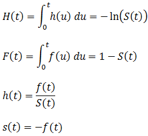
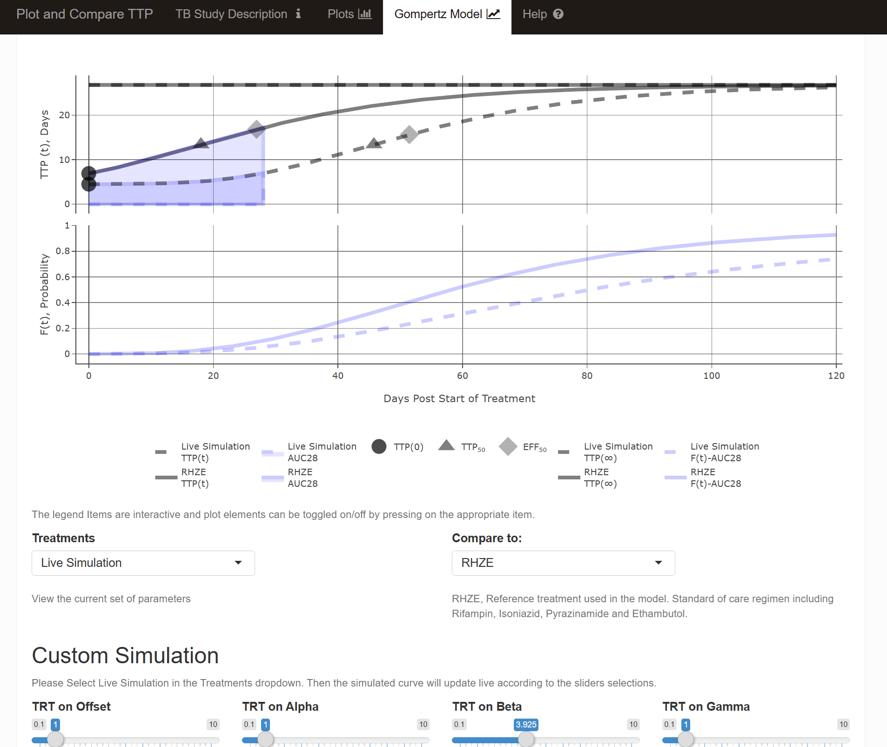

This is part 2 of last week blog post [Time to Positivity (TTP) in Tuberculosis Trials: Part 1](https://smouksassi.github.io/posts/ttpexplorepart1/)

I will continue covering the modeling and simulation activities that were performed in order to build the interactive tool. As reported earlier the app source code is publicly available at this [github repo](https://github.com/smouksassi/TBTTPEXPLORE) and is currently deployed online at this link [take me to the online interactive app](https://pharmacometrics.shinyapps.io/TBTTPEXPLORE/)

The four parameters (Offset, α, ß and Y) Gompertz TTP model was fitted:

$${\text{TTP}(t)=Offset +\alpha×\exp\left[-\beta×\exp\left(-\gamma×\text{Time}\right)\right]}$$ The treatment regimen RHZE was the reference with effects of each regimen on each of the four parameters which resulted in the following curves:

```{r,dev='ragg_png'}
#| message: false
#| warning: false
#| paged-print: true
#| fig-height: 5
#| fig-width: 9

library(ggplot2)
library(patchwork)
library(dplyr)
library(tidyr)
require(ggrepel)
library(table1)
library(tidyvpc)

Thetatrt <-  read.csv("Thetatrt.csv")
Thetatrt$label<- ifelse(Thetatrt$TRT==1,"TMC207",NA)
Thetatrt$label<- ifelse(Thetatrt$TRT==2,"Placebo",Thetatrt$label)
Thetatrt$label<- ifelse(Thetatrt$TRT==5,"MICRONUTRIENT\nRHZE",Thetatrt$label)
Thetatrt$label<- ifelse(Thetatrt$TRT==6,"PA-824/PZ/M",Thetatrt$label)
Thetatrt$label<- ifelse(Thetatrt$TRT==7,"PHZE",Thetatrt$label)
Thetatrt$label<- ifelse(Thetatrt$TRT==17,"MRZE",Thetatrt$label)
Thetatrt$label<- ifelse(Thetatrt$TRT==3,"RHZE",Thetatrt$label)

gompertzModelPRED <- function(df=Thetatrt,time = seq(0,98,1),
                              TRTvalue=1) {
  dffilter <- df %>% 
    filter(TRT==TRTvalue)
  predictedPRED <-   dffilter$tvE0+dffilter$tvAlpha*exp(-dffilter$tvBeta*exp(-dffilter$tvGam*time))
  predicted <- data.frame(TRT=dffilter$TRT,label=dffilter$label,
                          TIME=time ,PRED=predictedPRED )
  predicted
}
gompertzModelPREDall <- rbind(gompertzModelPRED(TRTvalue = 1),
      gompertzModelPRED(TRTvalue = 2),
      gompertzModelPRED(TRTvalue = 3),
      gompertzModelPRED(TRTvalue = 5),
      gompertzModelPRED(TRTvalue = 6),
      gompertzModelPRED(TRTvalue = 7),
      gompertzModelPRED(TRTvalue = 17))


ggplot(gompertzModelPREDall,aes(TIME,PRED))+
  geom_line(aes(col=label,group=label),
            show.legend = FALSE,size=2,alpha=0.5)+
  geom_text_repel(data=gompertzModelPREDall[gompertzModelPREDall$TIME==max(gompertzModelPREDall$TIME),],
                  aes(label=label,col=label,x=TIME),
                  show.legend = FALSE,nudge_y = 0,size=4,
                  nudge_x = 7,direction="y",
                  xlim = c(100, Inf),
                  lineheight = 0.8,
                  hjust = 0,force_pull = 2,force=10)+
  theme_bw(base_size = 16)+
  ylab("Predicted TTP")+
  xlab("Days on Treatment")+
  coord_cartesian(clip="off",xlim=c(NA,98))+
  theme(plot.margin = unit(c(1,4,1,1),"cm"))+
  scale_x_continuous(breaks=c(0,14,28,42,56,70,84,98))+
  scale_y_continuous(breaks=c(0,7,14,21,28))

```

and associated parameters table:

```{r,dev='ragg_png'}
#| message: false
#| warning: false
#| paged-print: true
#| fig-height: 6
#| fig-width: 9

Thetatrt %>% 
  select(Regimen=label,
         Offset=tvE0,
         alpha=tvAlpha,
         beta=tvBeta,
         gamma=tvGam) %>% 
  mutate(Regimen= ifelse(Regimen=="MICRONUTRIENT\nRHZE","MICRONUTRIENT RHZE",Regimen))%>% 
  knitr::kable(col.names =
                 c("Regimen","Offset",
                   "$\\alpha$","$\\beta$","$\\gamma$"),
                escape = FALSE,
               digits = 2)
```

<br> A more commonly used method to visualize parameter/covariate effects in pharmacometrics is expressing the effects as ratios with respect to a reference value, including the uncertainty of the estimated effects. Below I illustrate how we can read in the raw bootstrap results from the Phoenix NLME software that was used to fit this model. Next, we compute the 95% CI of the covariate effects and using `coveffectsplot` package function `forest_plot` doing these kind of graphics with an associated table has never been easier:

-   data wrangling:

```{r,dev='ragg_png'}
#| message: false
#| warning: false
#| paged-print: true
#| fig-height: 7
#| fig-width: 9

rawboot<- read.csv("Rawout_csv.csv")

bootthetacov <- rawboot %>%
  select(tvE0:dBetadBLMEANTTP)%>%
  gather(Parameter,value)%>%
  group_by(Parameter)%>%
  summarize(  mid = quantile(value,0.5  ),
            lower = quantile(value,0.025),
            upper = quantile(value,0.975)) %>%
  filter(mid!=0)%>%
  filter( ! stringr::str_detect(Parameter, 'tv'))%>%
  filter( ! stringr::str_detect(Parameter, 'BLMEANTTP'))%>%
  mutate(mid=exp(mid),lower=exp(lower),upper=exp(upper))

bootthetaparam <- rawboot%>%
  select(tvE0:dBetadBLMEANTTP)%>%
  gather(Parameter,value)%>%
  group_by(Parameter)%>%
  summarize(mid= median(value),
            lower=quantile(value,0.025),
            upper= quantile(value,0.975))%>%
  filter(mid!=0)%>%
  filter(  stringr::str_detect(Parameter, 'tv'))%>%
  mutate(lower=lower/mid,upper=upper/mid,mid=mid/mid )


bootthetacov$Parameter<- as.character(bootthetacov$Parameter)
bootthetaparam$Parameter<- as.character(bootthetaparam$Parameter)
boottheta<- rbind(bootthetacov,bootthetaparam)
boottheta$paramname<- ifelse(grepl("E0",boottheta$Parameter),"Offset",NA)
boottheta$paramname<- ifelse(grepl("Alpha",boottheta$Parameter),"Alpha",boottheta$paramname)
boottheta$paramname<- ifelse(grepl("Beta",boottheta$Parameter),"Beta",boottheta$paramname)
boottheta$paramname<- ifelse(grepl("Gam",boottheta$Parameter),"Gamma",boottheta$paramname)
boottheta$covname<- "Treatment Arm"
boottheta$label<- ifelse(grepl("T1",boottheta$Parameter),"TMC207",NA)
boottheta$label<- ifelse(grepl("T2",boottheta$Parameter),"Placebo",boottheta$label)
boottheta$label<- ifelse(grepl("T5",boottheta$Parameter),"MICRONUTRIENT/RHZE",boottheta$label)
boottheta$label<- ifelse(grepl("T6",boottheta$Parameter),"PA-824/PZ/M",boottheta$label)
boottheta$label<- ifelse(grepl("T7",boottheta$Parameter),"PHZE",boottheta$label)
boottheta$label<- ifelse(grepl("T17",boottheta$Parameter),"MRZE",boottheta$label)
boottheta$label<- ifelse(grepl("T3",boottheta$Parameter),"RHZE",boottheta$label)
boottheta$label<- ifelse(is.na(boottheta$label),"RHZE",boottheta$label)

boottheta<- boottheta%>%
  select(label,mid,lower,upper,paramname,covname)

df <-boottheta
df$covname<-factor(df$covname)
df$label<-factor(df$label)
df$ref<- 1
df$exposurename<- df$paramname
sigdigits<- 2
summarydata<- df %>%
  group_by(paramname,covname,label) %>%
  mutate(
    MEANEXP = mid,
    LOWCI = lower,
    UPCI =  upper,
    MEANLABEL=signif_pad(MEANEXP,sigdigits),
    LOWCILABEL =signif_pad(LOWCI,sigdigits),
    UPCILABEL =signif_pad(UPCI,sigdigits),
    LABEL= paste0(MEANLABEL," [",LOWCILABEL,"-",UPCILABEL,"]")
  )

summarydata$label <- factor(boottheta$label,
                            levels=c("RHZE","TMC207","Placebo","PHZE","PA-824/PZ/M","MRZE",
                                     "MICRONUTRIENT/RHZE"
                            ),
                            labels=c("RHZE","TMC207","Placebo","PHZE","PA-824/PZ/M","MRZE",
                                     "MICRONUTRIENT\nRHZE")
)
summarydata$paramname <- factor(boottheta$paramname,
                                levels=c("Offset","Alpha","Beta","Gamma"
                                ))
summarydata$paramname <- factor(summarydata$paramname,
                                labels = c("Offset","alpha","beta","gamma"))
summarydata$covname<- "Treatment~Arm"
```

-   plotting via `coveffectsplot::forest_plot`:

```{r,dev='ragg_png'}
#| message: false
#| warning: false
#| paged-print: true
#| fig-height: 7
#| fig-width: 9

forestplot<- coveffectsplot::forest_plot(summarydata,
                            table_position = "below",
                            plot_table_ratio = 1,
                            show_table_yaxis_tick_label = TRUE,
                            base_size = 10,
                            x_label_text_size = 10,
                            y_label_text_size = 10,
                            x_facet_text_size = 12,
                            y_facet_text_size = 12,
                            y_facet_text_angle = 90,
                            table_text_size = 4,
                            strip_placement = "inside",
                            facet_switch = "y",
                            combine_interval_shape_legend = TRUE,
                            interval_size = 1,
                            show_table_facet_strip = "both",
                            logxscale = TRUE,
                            x_range = c(0.5,2),
                            major_x_ticks = c(0.5,2/3,1,1.5,2),
                            major_x_labels = c("\n1/2","2/3","1","\n1.5","2"),
                            xlabel = "Ratio Change Relative to RHZE",
                            facet_labeller = "label_parsed",
                            strip_col = "#97B8FE", interval_col = "#17375E66",
                            interval_shape = "diamond"
)

```

Part of the goodness of fit of any model are the visual predictive check plots. I have written the foundation that led to the `tidyvpc` package to facilitate the computation of the needed statistics for the plotting and to provide data that can be easily used in `ggplot2`:

```{r,dev='ragg_png'}
#| message: false
#| warning: false
#| paged-print: true
#| fig-height: 7
#| fig-width: 9

library(tidyvpc)

originaldata <- read.csv("original_data.csv") %>% 
  select(ID,STUDID,ARM=ARM3,TIME,DV)
RESIDUALS    <- read.csv("Residuals_Final.csv") %>% 
  select(ID,TIME=IVAR,PRED,IPRED,DV)
originaldata <- left_join(originaldata,RESIDUALS)
simdata <- read.csv("PredCheckAll.csv")%>% 
select(ID,TIME=IVAR,DV,rep=Replicate)
originaldata$TIME <- as.double(originaldata$TIME)
vpcdatabase <- observed(originaldata, x = TIME, y = DV ) %>%
  simulated(simdata,y=DV) %>%
  predcorrect(pred=PRED) %>%
  stratify(~ STUDID+ARM) %>%
  binning(bin = "breaks", breaks = c(0,7,15,21,29,43,225),
          xbin = "xmid") %>%
  vpcstats()

p1 <- plot(vpcdatabase)

p1
```

While the `tidyvpc` package is very flexible and provides automatic plotting solutions, it gives the user full freedom to imagine and produce any type of graphical output that might better suite specific data/application. For example, I illustrate below how we can use a categorical binned x axis with proper ordering, labels and generate a plot from scratch:

```{r,dev='ragg_png'}
#| message: false
#| warning: false
#| paged-print: true
#| fig-height: 7
#| fig-width: 9

vpcdatabase$stats$bin <- reorder(vpcdatabase$stats$bin,
                                 vpcdatabase$stats$xbin)
ggplot(vpcdatabase$stats,aes(x=bin,y=md,group=qname))+
  geom_ribbon(aes(ymin=lo,ymax=hi,fill=qname),alpha=0.1,col=NA ) +
  geom_line(aes (fill=qname,col=qname)) +
  geom_line(data=vpcdatabase$stats,aes(x=bin,y=y,linetype="Obs"))+
    facet_wrap(~STUDID+ARM,
             scales="free",labeller = label_wrap_gen(multi_line=FALSE) ) +
  scale_colour_manual(name="Predictions Intervals\nMedian (lines)\n95% CI (areas)",
                      breaks=c("q0.05","q0.5","q0.95","Obs"),
                      values=c("red","blue","red","black"))+
  scale_fill_manual  (name="Predictions Intervals\nMedian (lines)\n95% CI (areas)",
                      breaks=c("q0.05","q0.5","q0.95","Obs"),
                      values=c("red","blue","red","black"))+
  scale_linetype_manual(name="Observed (lines)",
                        breaks=c("q0.05","q0.5","q0.95","Obs"),
                        values=c("solid","solid","solid","dashed")) +
  theme_bw()+
  theme(legend.position="right",axis.text.x = element_text(angle=40,
                                                           vjust=1,
                                                           hjust=1))+
  ylab("Obs/Simulated")+
  xlab("Days on Treatment (bins)")

```

As a perk, I show how we can bootstrap the observed data to compute confidence intervals around the observed percentiles and add it to the plot. This feature is not part of `tidyvpc` and is not often needed. But, it can be especially useful when we have low N of observed data and we want to show how "certain" the observed percentiles are:

```{r,dev='ragg_png'}
#| message: false
#| warning: false
#| paged-print: true
#| fig-height: 7
#| fig-width: 9

source("resample_df.R")
#from  https://metrumresearchgroup.github.io/PKPDmisc/reference/resample_df.html
#enable resampling with tratification and potentially multiple ID keys

predcorrectedobs <- vpcdatabase$obs
predcorrectedobs$ID <- vpcdatabase$data$ID
predcorrectedobs <- predcorrectedobs %>% 
  select(STUDID,ARM,ID,bin,x,y,ypc)

predcorrectedobs<- as.data.frame(predcorrectedobs)
NBOOT<- 20#small for blog do enough for real analysis
bootobservedPIall<- list()
for (i in (1:NBOOT) ) {
  bootdata <- resample_df(predcorrectedobs,key_cols=c("ID"),
                          strat_cols=c("STUDID","ARM")) %>% 
    as.data.frame()
  bootobservedPI <- bootdata %>% 
    group_by(STUDID,ARM,bin) %>% 
    summarize(y=quantile(ypc,probs=c(0.05,0.5,0.95), type=7),
              qname=c("q0.05","q0.5","q0.95"))
  bootobservedPI$replicate <- i  
  bootobservedPIall[[i]] <- bootobservedPI
}
bootobservedPIall<- data.table::rbindlist(bootobservedPIall)

bootobservedPIallPI <- bootobservedPIall %>% 
  group_by(STUDID,ARM,bin,qname) %>% 
  summarize(ybootci=quantile(y,probs=c(0.025,0.5,0.975), type=7),
            qci=c("lo","md","hi")) %>% 
  spread(qci,ybootci)


ggplot(vpcdatabase$stats,aes(x=bin,y=md,group=qname))+
  geom_ribbon(aes(ymin=lo,ymax=hi,fill=qname),alpha=0.1,col=NA ) +
  geom_line(aes(linetype=qname,col=qname,fill=qname)) +
  geom_line(data=bootobservedPIallPI,
            aes(linetype="Obs",col="Obs",fill="Obs"))+
  geom_ribbon(data=bootobservedPIallPI,aes(ymin=lo,ymax=hi,fill="Obs",
                                           group=qname),
              alpha=0.1,col=NA)+
  facet_wrap(~STUDID+ARM,
             scales="free",labeller = label_wrap_gen(multi_line=FALSE) ) +
  scale_colour_manual(name="Predictions Intervals\nMedian (lines)\n95% CI (areas)",
                      breaks=c("q0.05","q0.5","q0.95","Obs"),
                      values=c("red","blue","red","black"))+
  scale_fill_manual  (name="Predictions Intervals\nMedian (lines)\n95% CI (areas)",
                      breaks=c("q0.05","q0.5","q0.95","Obs"),
                      values=c("red","blue","red","black"))+
  scale_linetype_manual (name="Predictions Intervals\nMedian (lines)\n95% CI (areas)",
                        breaks=c("q0.05","q0.5","q0.95","Obs"),
                        values=c("solid","solid","solid","dashed")) +
  theme_bw()+
  theme(legend.position="right",axis.text.x = element_text(angle=40,
                                                           vjust=1,
                                                           hjust=1))+
  ylab("Obs/Simulated")+
  xlab("Days on Treatment (bins)")

```

If you want to see this feature built in in `tidyvpc` submit a github [issue!](https://github.com/certara/tidyvpc/issues)

Now that we have shown the TTP model and its goodness of fit I will discuss the time to cure model that was linked to the AUC of TTP from time 0 to time 28 days. It had the following hazard function:

```{r,dev='ragg_png'}
#| message: false
#| warning: false
#| code-fold: false

TTPAUC28  <- 332.3175 # computed dynamically from the TTP curve
hazard_fn_auc28 <- function(t){ exp(-11.8 -0.0270*t +   2.45*log(t+1) + 0.0353*((TTPAUC28-400)/10) ) }

```

plot of the hazard:

```{r,dev='ragg_png'}
#| message: false
#| warning: false
#| paged-print: true
#| fig-height: 4
#| fig-width: 9
source("gompertz_helpers.R")

Ftauc28 <- apply_survival_function(seq(0,120,0.1), hazard_fn_auc28,supplied_fn_type="h", fn_type_to_apply="F")
Stauc28 <- apply_survival_function(seq(0,120,0.1), hazard_fn_auc28,supplied_fn_type="h", fn_type_to_apply="S")
htauc28 <- apply_survival_function(seq(0,120,0.1), hazard_fn_auc28,supplied_fn_type="h", fn_type_to_apply="h")
    
ggplot(data.frame(Time=seq(0,120,0.1),
                  F_t=Ftauc28,
                  S_t=Stauc28,
                  h_t=htauc28))+
  geom_line(aes(x=Time,y=h_t,linetype="h(t)"))+
  labs(y="h(t)",linetype="")+
  theme_bw()


```

plot of the cumulative hazard and survival:

```{r,dev='ragg_png'}
#| message: false
#| warning: false
#| paged-print: true
#| fig-height: 4
#| fig-width: 9
ggplot(data.frame(Time=seq(0,120,0.1),
                  F_t=Ftauc28,
                  S_t=Stauc28,
                  h_t=htauc28))+
  geom_line(aes(x=Time,y=F_t,linetype="F(t)"))+
  geom_line(aes(x=Time,y=S_t,linetype="S(t)"))+
  labs(y="F(t) / S(t)",linetype="")+
  theme_bw()

```

The translation from the hazard function was based on code from this page [Graphing Survival and Hazard Functions](https://eurekastatistics.com/graphing-survival-and-hazard-functions/). Based on any hazard function it uses numerical differentiation and integration to compute/use: Hazard, Event Density, Survival Event Density, Cumulative Hazard, Lifetime Density, and Survival Probability using standard statistical relationships:



The app included an interactive `plotly` to head to head compare two treatment regimens. The user could also play with sliders to generate existing or new potential regimens. Below I compare the RHZE to the MHZE, I show the TTP over time on top with the associated AUC~0-28~ and below it the cumulative/lifetime probability of the event F(t).

```{r,dev='ragg_png'}
#| message: false
#| warning: false
#| paged-print: true
#| fig-height: 7
#| fig-width: 9

alldata <- makegompertzModelCurve(TRT="RHZE",
                                  tvOffset = Thetatrt %>%
                                    filter(label=="RHZE") %>%
                                    pull(tvE0),
                                  tvAlpha = Thetatrt %>%
                                    filter(label=="RHZE") %>%
                                    pull(tvAlpha),
                                      tvBeta = Thetatrt %>%
                                    filter(label=="RHZE") %>%
                                    pull(tvBeta),
                                      tvGamma = Thetatrt %>%
                                    filter(label=="RHZE") %>%
                                    pull(tvGam))

alldata <- alldata %>%
  group_by(TRT) %>%
  mutate(
    TIMETTPFLAG = ifelse(Time >= TIMETTPMAX50, 1, 0) ,
    cumsumttpflag = cumsum(TIMETTPFLAG)
  )
pointsdata <- alldata %>%
  group_by(TRT) %>%
  filter(cumsumttpflag == 1)
pointsdata2 <- alldata %>%
  group_by(TRT) %>%
  filter(Time == TIMEEFFMAX50)
alldataauc<- alldata[alldata$Time<=28,]


alldataMRZE <- makegompertzModelCurve(TRT="MRZE",
                                      tvOffset = Thetatrt %>% filter(label=="MRZE") %>% pull(tvE0),
                                      tvAlpha = Thetatrt %>% filter(label=="MRZE") %>% pull(tvAlpha),
                                      tvBeta = Thetatrt %>% filter(label=="MRZE") %>% pull(tvBeta),
                                      tvGamma = Thetatrt %>% filter(label=="MRZE") %>% pull(tvGam))
alldataMRZE <- alldataMRZE %>%
  group_by(TRT) %>%
  mutate(
    TIMETTPFLAG = ifelse(Time >= TIMETTPMAX50, 1, 0) ,
    cumsumttpflag = cumsum(TIMETTPFLAG)
  )
pointsdataMRZE <- alldataMRZE %>%
  group_by(TRT) %>%
  filter(cumsumttpflag == 1)
pointsdata2MRZE <- alldataMRZE %>%
  group_by(TRT) %>%
  filter(Time == TIMEEFFMAX50)
alldataaucMRZE<- alldataMRZE[alldataMRZE$Time<=28,]

alldata<- rbind(alldata,alldataMRZE)
pointsdata<- rbind(pointsdata,pointsdataMRZE)
pointsdata2<- rbind(pointsdata2,pointsdata2MRZE)
alldataauc<- rbind(alldataauc,alldataaucMRZE)

library(plotly)

p <-
  plot_ly(
    alldata,
    x = ~ Time,
    y = ~ TTPPRED,
    type = 'scatter',
    mode = 'lines',
    name = 'TTP(t)',
    legendgroup = "TTP(t)",
    line = list(color = toRGB("black", alpha = 0.5), width = 5),
    linetype =  ~ TRT,
    color = I('black'),
    hoverinfo = 'text',
    text = ~ paste(
      "</br> Treatment: ",
      TRT,
      '</br> Time: ',
      round(Time, 1),
      '</br> TTP(t): ',
      round(TTPPRED, 1)
    )
  ) %>%
  add_ribbons(
    data = alldataauc,
    x =  ~ Time ,
    ymin = 0,
    ymax =  ~ TTPPRED,
    name = 'AUC28',
    legendgroup = "AUC<sub>28</sub>",
    fillcolor = ~ TRT ,
    line = list(color = 'blue'),
    linetype =  ~ TRT,
    opacity = 0.2,
    hoverinfo = 'none'
  ) %>%
  add_markers(
    data = pointsdata2 ,
    x = 0,
    y = ~ TTP0,
    type = 'scatter',
    mode = 'markers',
    marker  = list(
      color = toRGB("black", alpha = 0.7),
      size = 20,
      symbol = "circle"
    ),
    name = "TTP(0)",
    legendgroup = "TTP(0)",
    inherit = FALSE,
    hoverinfo = 'text',
    text = ~ paste("</br> Treatment: ", TRT,
                   '</br> TTP(0): ', round(TTP0, 1))
    
  ) %>%
  
  add_markers(
    data = pointsdata ,
    x =  ~ TIMETTPMAX50,
    y = ~ TTPMAX50,
    type = 'scatter',
    mode = 'markers',
    marker  = list(
      color = toRGB("black", alpha = 0.5),
      size = 20,
      symbol = "triangle-up"
    ),
    name = "TTP<sub>50</sub>",
    legendgroup = "TTP<sub>50</sub>",
    inherit = FALSE,
    hoverinfo = 'text',
    text = ~ paste(
      "</br> Treatment: ",
      TRT,
      '</br> Time to TTP<sub>50</sub>: ',
      round(TIMETTPMAX50, 1),
      '</br> TTP<sub>50</sub>: ',
      round(TTPMAX50, 1)
    )
    
  ) %>%
  
  add_markers(
    data = pointsdata2 ,
    x =  ~ TIMEEFFMAX50,
    y = ~ EEFFMAX50,
    type = 'scatter',
    mode = 'markers',
    marker  = list(
      color = toRGB("black", alpha = 0.3),
      size = 20,
      symbol = "diamond"
    ),
    name = "EFF<sub>50</sub>",
    legendgroup = "EFF<sub>50</sub>",
    inherit = FALSE,
    hoverinfo = 'text',
    text = ~ paste(
      "</br> Treatment: ",
      TRT,
      '</br> Time to EFF<sub>50</sub>: ',
      round(TIMEEFFMAX50, 1),
      '</br> EFF<sub>50</sub>: ',
      round(EEFFMAX50, 1)
    )
    
  ) %>%
  add_lines(
    data = alldata ,
    x = ~ Time,
    y = ~ TTPINF,
    type = 'scatter',
    mode = 'lines',
    name = 'TTP(\u221E)',
    line = list(color = toRGB("black", alpha = 0.5), width = 5),
    linetype =  ~ TRT,
    color = I('black'),
    legendgroup = "TTP(\u221E)",
    inherit = FALSE,
    hoverinfo = 'text',
    text = ~ paste("</br> Treatment: ", TRT,
                   '</br> TTP(\u221E) ', round(TTPINF, 1))
  ) %>%
  
  layout(
    xaxis = list(
      title = 'Days Post Start of Treatment',
      ticks = "outside",
      autotick = TRUE,
      ticklen = 5,
      range = c(-2, 121),
      gridcolor = toRGB("gray50"),
      showline = TRUE
    ) ,
    yaxis = list (
      title = 'TTP (t), Days'               ,
      ticks = "outside",
      autotick = TRUE,
      ticklen = 5,
      gridcolor = toRGB("gray50"),
      showline = TRUE)
    # ) ,
    # legend = list(
    #   orientation = 'h',
    #   xanchor = "center",
    #   y = -0.25,
    #   x = 0.5
    # )
  )
p2 <-
  plot_ly(
    alldata,
    x = ~ Time,
    y = ~ Ft,
    type = 'scatter',
    mode = 'lines',
    name = 'F(t)-AUC28',
    legendgroup = "F(t)-AUC28",
    line = list(color = toRGB("blue", alpha = 0.2), width = 5),
    linetype =  ~ TRT,
    color = I('black'),
    hoverinfo = 'text',
    text = ~ paste(
      "</br> Treatment: ",
      TRT,
      '</br> Time: ',
      round(Time, 1),
      '</br> F(t): ',
      round(Ft, 1)
    )
  ) %>%
  layout(
    xaxis = list(
      title = 'Days Post Start of Treatment',
      ticks = "outside",
      autotick = TRUE,
      ticklen = 5,
      range = c(-2, 121),
      gridcolor = toRGB("gray50"),
      showline = TRUE
    ) ,
    yaxis = list (
      title = 'F(t), Probability'               ,
      ticks = "outside",
      autotick = TRUE,
      ticklen = 5,
      gridcolor = toRGB("gray50"),
      showline = TRUE
    ) ,
    legend = list(
      orientation = 'h',
      xanchor = "center",
      y = -0.25,
      x = 0.5
    )
  )
subplot(p, p2,nrows = 2,shareX = TRUE,shareY = FALSE,titleX = TRUE,titleY = TRUE)

```

Finally the app, enabled "saving" user custom scenarios that could be later compared head to head and then output to a table and downloaded. It also included extensive documentation and how to guides. Below I include a screenshot showing how the user can start from a know regimen (RHZE) apply an effect (e.g. higher reatment effect on Beta) and head to head compare the Live Simulation to the reference (RHZE):


