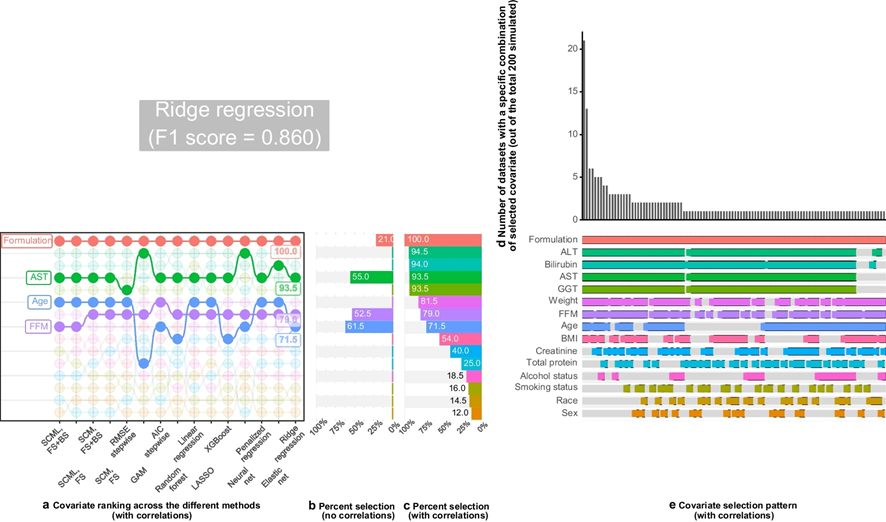

During PAGE 2024, I presented with one of my former colleagues a poster on [Upset Plots](https://www.page-meeting.org/Abstracts/mastering-upset-plots-a-comprehensive-tutorial-for-effective-data-visualization-in-pharmacometrics-and-drug-development/). I am revisiting this cool way to visualize and present intersections of data when we have many possibilities. I will focus on one of the examples on COVID-19 symptoms, demonstrating some useful features, merely scratching the surface of what Upset Plots can do. For more details on the methodology refer to this website <https://upset.app/>. The original authors also provide a [web-app](https://upset.app/upset/#upset-20).

First, I read in the data, do some data management, and simulate an artificial age column that is a function of the number of symptoms to illustrate how we can annotate these plots with continuous variables.

```{r,dev='ragg_png'}
#| message: false
#| warning: false
#| paged-print: true
#| fig-height: 5
#| fig-width: 12

library(tidyverse)
library(ggplot2)
library(ComplexUpset)
library(patchwork)
library(lemon)

set.seed(146651321)
symptoms <- c("Anosmia", "Cough", "Fatigue", "Diarrhea", "Breath", "Fever")
names(symptoms) <- symptoms
dat <- read.csv("symptoms.csv") 
subsets <- dat$combination

symptom_mat <- map(subsets, \(x) str_detect(x, symptoms)) %>%
  set_names(nm = subsets) %>%
  map(\(x) set_names(x, nm = symptoms)) %>%
  bind_rows(.id = "subset") %>%
  left_join(dat, join_by(subset == combination))

symptom_expand <- symptom_mat %>%
  uncount(count) 
symptom_expand$subject<- 1:nrow(symptom_expand)
symptom_expand <- symptom_expand %>% 
  rowwise() %>% 
  mutate(ntot = sum(c_across(Anosmia:Fever)))%>%
  ungroup() %>% 
  mutate(age=60*(ntot*1.2/5)*exp(rnorm(1764, 0, 0.16)))
```

Before trying the Upset Plot why not try a classical Venn Diagram? First using the `eulerr` package:

```{r,dev='ragg_png'}
#| message: false
#| warning: false
#| paged-print: true
#| fig-height: 6
#| fig-width: 9

library(eulerr)
plot(euler(symptom_expand[,2:7], shape = "ellipse"), quantities = TRUE)
```

Also using the `ggVennDiagram` which requires a specific format for the input data. Notice how this is at the edge of Venn diagrams and where it is very hard to see and appriciate all the intersections!

```{r,dev='ragg_png'}
#| message: false
#| warning: false
#| paged-print: true
#| fig-height: 5
#| fig-width: 9
library(ggVennDiagram)

Anosmia = symptom_expand[,2:7] %>% 
    mutate(num = 1:n()) %>%
    filter(Anosmia) %>%
    pull(num)

Cough = symptom_expand[,2:7] %>% 
  mutate(num = 1:n()) %>%
  filter(Cough) %>%
  pull(num)

Fatigue = symptom_expand[,2:7] %>% 
  mutate(num = 1:n()) %>%
  filter(Fatigue) %>%
  pull(num)

Diarrhea = symptom_expand[,2:7] %>% 
  mutate(num = 1:n()) %>%
  filter(Diarrhea) %>%
  pull(num)

Breath = symptom_expand[,2:7] %>% 
  mutate(num = 1:n()) %>%
  filter(Breath) %>%
  pull(num)

Fever = symptom_expand[,2:7] %>% 
  mutate(num = 1:n()) %>%
  filter(Fever) %>%
  pull(num)
datalist<- list(Fatigue,Anosmia,Cough,Fever,
                Diarrhea,Breath)
names(datalist) <- c("Fatigue","Anosmia","Cough","Fever",
                      "Diarrhea","Breath")
venplot<- ggVennDiagram(datalist,
              set_color = c("#59a89c","#a559aa","#bababa","#ff73b6","#8ec1da","#f0c571"),
              set_size = 4,
              label = c("count"),
              label_geom = c("text"))+
  scale_fill_gradient(low="white",high = "red")

venplot
```

Trying a minimal Upset plots !

```{r,dev='ragg_png'}
#| message: false
#| warning: false
#| paged-print: true
#| fig-height: 5
#| fig-width: 12

upset(data = symptom_expand, intersect = symptoms, 
      keep_empty_groups=TRUE,
      width_ratio=0.4
)

```

Then, I keep the top 15 intersections with `n_intersections=15`, add an `annotation` of age with a violin distribution per intersection, and customize the `set_sizes` with text showing the total N, and flipping the order by using `sort_intersections=ascending`

```{r,dev='ragg_png'}
#| message: false
#| warning: false
#| paged-print: true
#| fig-height: 7
#| fig-width: 12

upsetplot <- upset(data = symptom_expand, intersect = symptoms, 
      annotations = list(
        'age'=(
          ggplot(mapping=aes(x=intersection,y=age))+
            geom_violin(alpha=0.5, na.rm=TRUE,
                        quantile.linetype = "solid")+
            scale_y_continuous(name="Age (years)")
      )
      ),
      set_sizes=(
        upset_set_size()
        + geom_text(aes(label=..count..), hjust=0, stat='count',col="white")
        + theme(axis.text.x=element_text(angle=90))
        + scale_x_continuous(expand= expansion(add = 0, mult = 0))
        + scale_y_reverse(expand =expansion(add = 0, mult = 0))
        
        ),
      keep_empty_groups=TRUE,
      width_ratio=0.4,
      n_intersections=15,
      sort_intersections='ascending',#sort_intersections_by=c('degree', 'cardinality'),
      name="Symptom Intersection by Ascending Frequency from a total of 1,764 individuals.\nTop 15 Intersections shown", 
)

upsetplot 

```

And then switching the `sort_intersections_by` to degree then cardinality which will reveal that age is linearly related to the number of concomitant symptoms present:

```{r,dev='ragg_png'}
#| message: false
#| warning: false
#| paged-print: true
#| fig-height: 7
#| fig-width: 12

upsetplot <- upset(data = symptom_expand, intersect = symptoms, 
      annotations = list(
        'age'=(
          ggplot(mapping=aes(x=intersection,y=age))+
            geom_violin(alpha=0.5, na.rm=TRUE,
                        quantile.linetype = "solid")+
            scale_y_continuous(name="Age (years)")
      )
      ),
      set_sizes=(
        upset_set_size()
        + geom_text(aes(label=..count..), hjust=0, stat='count',col="white")
        + theme(axis.text.x=element_text(angle=90))
        + scale_x_continuous(expand= expansion(add = 0, mult = 0))
        + scale_y_reverse(expand =expansion(add = 0, mult = 0))
        
        ),
      keep_empty_groups=TRUE,
      width_ratio=0.4,
      n_intersections=15,
      sort_intersections_by=c('degree', 'cardinality'),
      name="Symptom Intersection by Ascending Frequency from a total of 1,764 individuals.\nTop 15 Intersections shown", 
)

upsetplot 
```

What if I want to highlight a particular combination of symptoms? This is what `queries` are for controlling which intersection / set to highlight. I also illustrate how to make the Set Size axis logged:

```{r,dev='ragg_png'}
#| message: false
#| warning: false
#| paged-print: true
#| fig-height: 7
#| fig-width: 12


upset(data = symptom_expand, intersect = symptoms, 
      encode_sets=FALSE, 
      matrix=(
        intersection_matrix(
          geom=geom_point(
            shape='square',
            size=3.5
          ),
          segment=geom_segment(
            linetype='dotted'
          ),
          outline_color=list(
            active='red',
            inactive='blue'
          )
        )
      ),
      queries=list(
        upset_query(
          intersect=c('Fatigue', 'Cough'),
          color='red', fill='red',
          only_components=c('intersections_matrix', 'Intersection size')
        ),
        upset_query(
          intersect=c('Fatigue'),
          color='darkgray', fill='darkgray',
          only_components=c('intersections_matrix', 'Intersection size')
        )
      ),
      keep_empty_groups=TRUE,
      width_ratio=0.4,
      n_intersections=15,
      name="Symptom Intersection by Ascending Frequency from a total of 1,764 individuals.\nTop 15 Intersections shown", 
)

upset(data = symptom_expand, intersect = symptoms, 
                   set_sizes=(
                     upset_set_size()
                     + geom_text(aes(label=..count..), hjust=0, stat='count',col="white")
                     + theme(axis.text.x=element_text(angle=90))
                     + scale_x_continuous(expand= expansion(add = 0, mult = 0))
                     + scale_y_continuous(
                       breaks = scales::trans_breaks("log10", function(x) 10^x),
                       labels = scales::trans_format("log10", scales::math_format(10^.x)),
                       trans=reverse_log_trans(),
                       expand =expansion(add = 0, mult = 0))
                   ),
                   queries=list(upset_query(set='Fatigue', fill='blue')),
                   keep_empty_groups=TRUE,
                   width_ratio=0.4,
                   n_intersections=15,
                   name="Symptom Intersection by Ascending Frequency from a total of 1,764 individuals.\nTop 15 Intersections shown", 
)

```

Including the intersection ratios, and customizing the text mappings

```{r,dev='ragg_png'}
#| message: false
#| warning: false
#| paged-print: true
#| fig-height: 7
#| fig-width: 12

size = get_size_mode('exclusive_intersection')
upset(
  data = symptom_expand, intersect = symptoms,
  base_annotations=list(
    'Intersection size'=intersection_size(
      text_mapping=aes(
        label  = !!size,
        #colour = ifelse(!!size > 69, 'on_bar', 'on_background'),
        #y = ifelse(!!size > 69, !!size - 60, !!size)
      ),
      text=list(vjust=-0.2),
      bar_number_threshold = 0.75
    ),
    'Intersection ratio'=intersection_ratio(
      text_mapping=aes(
      label=paste0(
      round(!!get_size_mode('exclusive_intersection')),"/",
      round(!!get_size_mode('inclusive_union')),
      '\n(',
      !!upset_text_percentage(),
      ')'
      )
      ),
      text=list(vjust=-0.3) )
  ),
  set_sizes=(
    upset_set_size()
    + geom_text(aes(label=..count..), hjust=0, stat='count',col="white")
    + theme(axis.text.x=element_text(angle=90))
    + scale_x_continuous(expand= expansion(add = 0, mult = 0))
    + scale_y_reverse(expand =expansion(add = 0, mult = 0))
    
  ),
  width_ratio=0.4,
  n_intersections=10
)
```

And finally, I combine the ggVennDiagram with the Upset Plot using some `patchwor` layout and `lemon::g_legend` magic:

```{r,dev='ragg_png'}
#| message: false
#| warning: false
#| paged-print: true
#| fig-height: 9
#| fig-width: 12

venplot<- ggVennDiagram(datalist,
              set_color = c("#59a89c","#a559aa","#bababa","#ff73b6","#8ec1da","#f0c571"),
              set_size = 4,
              label = c("count"),
              label_geom = c("text"))+
  scale_fill_gradient(low="white",high = "red")


upsetplotven<- upset(data = symptom_expand, intersect = symptoms,
                     
                     base_annotations=list(
                       'Intersection size'=intersection_size(
                         mapping = aes(fill =  !!size),
                         text_mapping=aes(label  = !!size),
                         text=list(vjust=-0.2,size=3.5),
                         bar_number_threshold = 0.75,
                         legend = NULL
                       )
                       ),
      set_sizes=(
        upset_set_size()
        + geom_text(aes(label=..count..), hjust=0, stat='count',col="black")
        + theme(axis.text.x=element_text(angle=90))
        + scale_x_continuous(expand= expansion(add = 0, mult = 0))
        + scale_y_reverse(expand =expansion(add = 0, mult = 0))
      ),
      queries=list(upset_query(set='Anosmia', fill='#a559aa'),
                   upset_query(set='Cough', fill='#bababa'),
                   upset_query(set='Fatigue', fill='#59a89c'),
                   upset_query(set='Diarrhea', fill='#8ec1da'),
                   upset_query(set='Breath', fill='#f0c571'),
                   upset_query(set='Fever', fill='#ff73b6')),
      keep_empty_groups=TRUE,
      width_ratio=0.4,
      #n_intersections=20,#
      sort_intersections='descending',#sort_intersections_by=c('degree', 'cardinality'),
      name="Symptom Intersection by Descending Frequency from a total of 1,764 individuals.", 
)

scalelegend<- lemon::g_legend( 
                     upsetplotven[[2]]+
                     theme(legend.position = "top")+
                     scale_fill_gradient(name="exclusive intersections count",
                                         low= "red",high ="white" ,
                                         breaks = c(50,100, 150, 200, 250,300),
                                         trans = 'reverse' )+
                       theme(
                         #legend.key.height = unit(1, "null"), # Makes keys expand vertically
                         legend.key.width = unit(1, "null") ,  # Makes keys expand horizontally
                         legend.title.position = "top",
                         legend.title = element_text(hjust = 0)
                       )
)

layout <- "
EEEEEEE
DDDAAAA
DDDAAAA
DDDAAAA
CCCBBBB
"
   (upsetplotven[[2]]+
       theme(legend.position = "none")+
       scale_fill_gradient(name="exclusive intersections count",
                           low= "red",high ="white" ,
                           breaks = c(50,100, 150, 200, 250,300), 
                            trans = 'reverse' ))+
   upsetplotven[[4]]+
   upsetplotven[[3]]+ 
    (venplot+theme(legend.position = "none"))+
  scalelegend+
  plot_layout(design = layout)

```

A useful application of this technique was shared in one of my papers: [Machine-Learning Assisted Screening of Correlated Covariates: Application to Clinical Data of Desipramine](https://pubmed.ncbi.nlm.nih.gov/38816519/). Refer to the supplementary materials where we shared all the code to reproduce figure 3 from the manuscript: 

We built a patchwork including a "bump" plot and not only showing how often each covariate was selected but also which combination (intersection set) was most frequent.

Until next time, comment on LinkedIn and share what is your go to solutions for showing intersection sets!.

